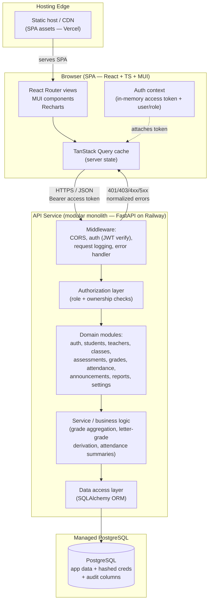
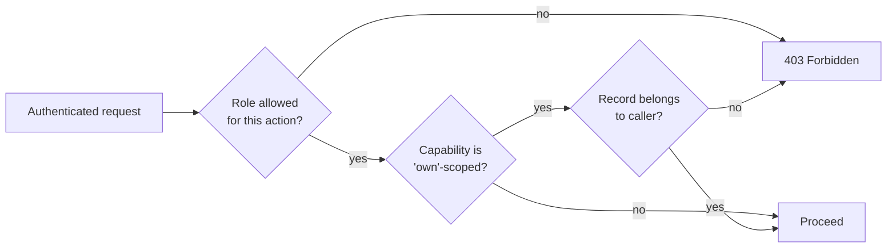

# System Architecture — School Management System (SIS)

> **Phase 2 — System Architecture.** Owner: `product-architect`. This document resolves the high-level technical decisions that Phases 3–7 build on: backend technology + hosting (Open Issue **O1**), authentication/authorization model, module breakdown, folder structures, the data/state strategy, and cross-cutting concerns. It honors all locked decisions in `progress-tracker.md` (D2, D5, D8–D11) and the requirements in `requirements.md`.
>
> It does **not** define the detailed DB schema (Phase 4), UI design (Phase 3), or the full API spec (Phase 5) — but it makes the decisions those phases extend.

_Last updated: 2026-08-06 — **D29 subject-class model** (supersedes the D23 section model); Phase 4.5 reconciliation (class_subjects ownership rescope / OQ-DB8; D24 transcript)_

> **D29 (2026-08-06) — a "class" is a SUBJECT CLASS, not a homeroom.** The school is a sixth
> form: the office creates subject classes ("Math-1") and enrols each student into the ones
> they take, so a student holds **many** concurrent enrolments. **The ownership model below is
> unchanged** — a teacher is still assigned to a `class_subjects` row, and both helpers still
> apply; what changed is that a class now has exactly one such row, so
> `assert_teacher_owns_class_subject` and `assert_teacher_owns_section` answer the same
> question for a D29 class. New: `class_meetings` (weekly slots) and Module 13 (Timetable).
> See `requirements.md` §3.5/§3.5a and `database-schema.md` §3.C.

---

## 1. Architecture Overview

The SIS is a **single-page application (SPA) + JSON API + relational database** — a classic, pragmatic three-tier web architecture. For a single-school SIS (D8) serving up to ~2,000 students and ~150 staff (NFR-PERF-01), this is deliberately the *right size*: no microservices, no event sourcing, no message brokers, no Kubernetes. One deployable frontend, one deployable backend, one managed database.

**Architectural style:** **Modular monolith** on the backend. A single deployable service internally organized into clear module boundaries (one per functional domain). This gives us the simplicity of a monolith (one repo concern, one deploy, transactional integrity across modules, no network hops between domains) while keeping the codebase evolvable — if a module ever needs to split out, the boundary already exists.

### 1.1 High-level component diagram



### 1.2 Request / data flow (typical authenticated read)

1. User loads the SPA from the static host/CDN. React Router renders the route; a route guard checks the in-memory auth state.
2. A TanStack Query hook fires an `HTTPS` request to the API, attaching the JWT **access token** as a `Bearer` header.
3. Backend middleware verifies the token signature/expiry, resolves the user + role, and logs the request.
4. The **authorization layer** checks the role against the permission matrix (§2 of requirements) and, where needed, **record ownership** (e.g., "is this teacher assigned to this `class_subject`?", or "do they teach any subject in this section?").
5. The domain module calls the service layer (business rules), which calls the data-access layer (ORM) against PostgreSQL.
6. The response returns as JSON; TanStack Query caches it by query key. On writes, the relevant query keys are invalidated so views refresh without a full reload (NFR-PERF-03).

---

## 2. Technology Decisions (resolves O1)

> Decisive picks with the trade-off I accepted for each. Optimized for a single-school app, the user's existing fluency (Python/FastAPI, TS, Railway/Vercel/Supabase), and end-to-end maintainability.

| Concern | Decision | One-line rationale | Trade-off accepted |
|---|---|---|---|
| **Backend language/framework** | **Python + FastAPI** | Native Pydantic validation + automatic OpenAPI generation (feeds Phase 5 directly), async, and the user's strongest stack — fastest path to a correct, typed API. | Python is less type-strict end-to-end than a TS backend (no shared types with the frontend out of the box); we mitigate with Pydantic + generating a TS client from the OpenAPI schema. |
| **Database** | **PostgreSQL (managed)** | Relational data (students↔classes↔grades↔attendance) is highly normalized and integrity-critical; Postgres gives FKs, transactions, constraints, and strong querying for reports. | A managed instance costs more than SQLite-on-a-VM, but data integrity and concurrent writes (teachers entering grades simultaneously) require a real RDBMS. |
| **ORM / data access** | **SQLAlchemy 2.0 + Alembic migrations** | Mature, typed, the de-facto Python ORM; Alembic gives versioned schema migrations for Phase 4. | More boilerplate than a "batteries-included" framework ORM; acceptable for the control it gives. |
| **Auth approach** | **Custom JWT (short-lived access token + refresh token)**, passwords hashed with **Argon2id** | Self-contained, no per-request DB lookup for auth, fits the modular monolith, satisfies D9 (hashed passwords, RBAC, TLS) without a third-party identity dependency. | We own token lifecycle/rotation logic (vs. offloading to an IdP). Justified: admin-provisioned accounts (D5), single tenant (D8), and 4 fixed roles make a custom RBAC simpler than wiring an external IdP. See §3. |
| **Hosting — backend + DB** | **Railway** (API container + managed Postgres) | The user already uses Railway successfully; one platform for the API and the database, simple env-var config, painless deploys. | Not multi-region/HA out of the box — acceptable under D9 (region flexible, no residency mandate) and single-school scale. |
| **Hosting — frontend** | **Vercel** (static SPA) | The user already uses Vercel; excellent DX, global CDN, preview deployments per PR. | Splits hosting across two providers; trivial to manage and keeps the SPA on a CDN where it belongs. |
| **API style** | **REST/JSON** (resource-oriented), versioned under `/api/v1` | Maps cleanly to the CRUD-heavy modules; OpenAPI auto-doc; easy for TanStack Query. | No GraphQL flexibility for ad-hoc client queries — unnecessary here; REST + well-shaped endpoints covers every documented flow. |

### 2.1 Alternatives considered (and why not)

- **Supabase (as full BaaS: Postgres + GoTrue auth + RLS + auto-generated API).** Strong contender — the user knows it well and it would remove most backend code. **Rejected as the primary backend** because the SIS has substantial server-side business logic (weighted term-grade aggregation FR-GRD-04, exempt handling FR-GRD-05, letter-grade derivation FR-GRD-03, grade-release gating FR-GRD-09, attendance summaries FR-ATT-06, ownership-based authorization). Pushing that into Postgres RLS policies + edge functions is harder to test and reason about than a clean FastAPI service layer. We can still use **Supabase purely as the managed Postgres** if Railway Postgres is undesirable — the app code is unaffected.
- **Node/TypeScript backend (NestJS/Express).** Would give one language across the stack and shared types. **Rejected** because the user's deepest fluency is FastAPI, and FastAPI's Pydantic + OpenAPI story is excellent for feeding the Phase 5 contract and a generated TS client. The type-sharing gap is closed by codegen.
- **SQLite.** Tempting for a single-school app. **Rejected** for concurrent-write reliability (multiple teachers writing grades/attendance at once) and weaker tooling for the reporting queries.

---

## 3. Authentication & Authorization Model

### 3.1 Login flow (FR-AUTH-01..05)

```mermaid
sequenceDiagram
    participant U as Browser (SPA)
    participant A as API (/api/v1/auth)
    participant DB as PostgreSQL

    U->>A: POST /auth/login {identifier, password}
    A->>DB: fetch user by email/username
    A->>A: verify password (Argon2id), check active + lockout
    alt valid
        A->>A: issue access token (JWT, ~15 min) + refresh token (~7 days)
        A-->>U: 200 {access_token, user{ id, role, name }}; refresh token in HttpOnly cookie
        U->>U: store access token in memory; route to role dashboard
    else invalid
        A->>DB: increment failed-attempt counter
        A-->>U: 401 "invalid credentials" (non-enumerating)
    end
```

- **Access token (JWT):** short-lived (~15 min), held **in memory** in the SPA (not localStorage — reduces XSS token theft). Carries `sub` (user id), `role`, and expiry. Sent as `Authorization: Bearer`.
- **Refresh token:** longer-lived (~7 days), stored in an **HttpOnly, Secure cookie** (SameSite policy below). The SPA calls `POST /auth/refresh` to mint a new access token when the current one expires (silent refresh). Logout (FR-AUTH-05) clears the cookie and revokes the refresh token server-side.
- **Server-side refresh-token / session store (NOT purely stateless):** refresh-token **revocation** (logout, password reset, lockout) and **idle timeout** (FR-AUTH-10) cannot be enforced by a stateless JWT alone. The backend therefore persists a **session/refresh-token store** — one row per active refresh token (user, token id/hash, issued + last-used timestamps, revoked flag). `/auth/refresh` validates the presented token against this store, checks the idle window, rotates the token, and updates `last-used`. **This is a first-class entity for Phase 4 (schema) and Phase 5 (auth contract), not an afterthought.**
- **Cross-origin cookie posture (Vercel SPA ↔ Railway API):** the SPA and API live on **different origins**, so the refresh cookie must be `Secure` + **`SameSite=None`** to be sent on the cross-site `/auth/login` and `/auth/refresh` calls, and CORS must be **credentialed** (`Access-Control-Allow-Credentials: true` with an explicitly allow-listed origin — never `*` alongside credentials). **`SameSite=Strict`/`Lax` will silently drop the cookie across origins and break refresh.** Wiring this correctly — plus a **smoke test that a hard-reload session survives** — is a **Phase 6 foundation task**. (A same-origin topology via one domain or a reverse proxy would permit `Strict`, but is not the chosen layout.)
- **App bootstrap (silent refresh before guards):** on a hard reload the in-memory access token is gone, so on startup `AuthProvider` attempts a silent `POST /auth/refresh` **before** route guards render; guards show a loading state until bootstrap resolves to authenticated or anonymous. The API client serializes concurrent 401-triggered refreshes (**single-flight**: one refresh in flight; other requests queue and replay on success) to avoid a refresh stampede. (See §7.2.)
- **Idle timeout (FR-AUTH-10):** enforced by access-token expiry + a configurable inactivity window tracked on the session store (`last-used`); after the window, refresh is refused and the user must re-authenticate.
- **Brute-force throttling (FR-AUTH-07):** per-account failed-attempt counter with temporary lockout after a configurable threshold.
- **Password policy (FR-AUTH-09):** minimum length + complexity validated server-side at create/change. Stored only as **Argon2id** salted hashes (NFR-SEC-03).
- **Password reset (FR-AUTH-08):** **admin-initiated reset** for v1 (aligns with D5 admin-provisioned accounts; avoids an email-delivery dependency). Self-service email reset is a clean later enhancement. *(Resolves Q5 for the architecture: admin-initiated.)*

### 3.2 Authorization — RBAC + ownership (FR-AUTH-06, NFR-SEC-01)

Authorization is **enforced server-side on every protected action**; the frontend only *hides* controls for UX (it is not the security boundary).

Two layers:

1. **Role gate (coarse):** Does this role have any access to this module/action per the §2 matrix? Implemented as a reusable FastAPI dependency, e.g. `require_role(Principal, Secretary)`.
2. **Ownership/scope gate (fine):** For "own"-scoped capabilities (Teacher → own teaching assignments; Student → own data), the service verifies the record actually belongs to the caller before returning or mutating it. Examples: a Teacher can only enter grades/assessments for a `class_subject` they are assigned to (FR-GRD-10, FR-ASMT) and can only take the daily register for a section they teach in (FR-ATT-09); a Student can only read their own grades (FR-GRD-07).

**User ↔ domain-record linkage.** An authenticated `user` is linked to its domain record by a relationship: **user → teacher** (the user *is* that teacher) and **user → student** (the user *is* that student). Principal/Secretary users are admin accounts not tied to a student/teacher academic record. The relationship is named here; column/FK details are deferred to Phase 4. Every "own"-scoped authorization derives its subject from this linkage on the authenticated principal — **not** from the request.

**Teacher ownership — single source of truth (resolves Q9; rescoped for D23 section model; resolves OQ-DB8).** Under D23 a "class" is a multi-subject **section/homeroom** (e.g. "Form 1A"); subjects are taught within it via the **`class_subjects` join**, and a teacher is assigned per **(section, subject)** — i.e. to a `class_subjects` row — through the many-to-many **`class_teachers` assignment relation**. "Ownership" is therefore defined as **"the caller is among the assigned teachers of the relevant `class_subject` — or among the assigned teachers of *any* `class_subject` in the section, for section-scoped operations."** Because the unit of ownership differs by concern, the check lives in **two reusable helpers** in `core/rbac.py` (no per-module re-implementation):

- **`assert_teacher_owns_class_subject(user, class_subject_id)`** — used by **Grades, Assessments, the gradebook, and class-subject-scoped Announcements**. Passes iff a `class_teachers` row exists for `(class_subject_id, user→teacher_profiles.id)`.
- **`assert_teacher_owns_section(user, class_id)`** — used by the **daily attendance register and other section-scoped concerns**. A teacher "owns" a section if they teach **any** `class_subject` in it (any subject teacher of the homeroom may take the per-day register). Passes iff a `class_teachers` row exists for the caller on some `class_subjects` row whose `class_id` is the given section.

Grade/assessment writes resolve the `class_subject_id` from the assessment (or are passed it directly); the per-section attendance register resolves the section `class_id` directly. **Decision recorded: co-teachers DO get full edit rights** (all assigned teachers of a `class_subject` can edit its grades/assessments; any section teacher can take attendance and post class-subject announcements) — the simplest membership model; confirmable with the stakeholder.

**Student-scoped subject is server-derived, never client-supplied (hard rule).** For every student-scoped read/write, the target `student_id` is resolved **from the authenticated principal** via the user→student linkage — **never** from a client-supplied path segment, query param, or body field. A Student requesting another student's data therefore cannot succeed by editing the URL: the server ignores any supplied id and uses the principal's own. (Admin/Teacher endpoints that legitimately address a specific student still go through the role + ownership gates above.)

**Grade-release enforcement is a server-side read filter (FR-GRD-09).** Release status is enforced as a **filter applied on every student-facing grade and report-card read path** in the Grades/Reports service — unreleased scores and unreleased term grades are excluded server-side before the response is built. Teacher (own classes), Secretary, and Principal read paths **bypass** the release filter for oversight. This is **not** a frontend-only "hide" — the SPA never receives unreleased data for a student. (See §8.5.)



**Frontend enforcement:** React Router route guards check the in-memory role and redirect unauthorized navigation (validating the AC: a Student manually visiting an admin URL is redirected and gets no data). A central permission map mirrors the §2 matrix so menus, buttons, and routes render per role — but every gated call is independently re-checked by the API.

**Roles are fixed (6 as of D43: principal, secretary, teacher, student, hod, auditor)** and **single per user (A-ONE-ROLE)**, so role is a simple enum on the user record — no role/permission join tables needed for v1.

> **D43 added a THIRD authorization layer, above the other two.** The role gate is an allowlist of role names and cannot express "GET only", so the Auditor's read-only rule could not be written as one: expressing it per-route would have meant getting all ~121 `Depends(...)` tuples right, where a single miss is a read-only account that can delete a student. It is enforced once in `get_current_user` — the one dependency every authenticated route passes through — which inverts the default: **a new endpoint is read-only for an Auditor the day it is written, without its author knowing the role exists.**
>
> The HOD's programme scope is NOT in that layer. It is ordinary layer-2 ownership work (`app/core/rbac.py::hod_*`), because it narrows *which rows* come back rather than *whether* the call is allowed — and, like every other 'own'-scoped rule here, it derives from the authenticated principal (`program_heads`), never from the request.

---

## 4. Module Breakdown

Each backend domain module owns its routes, service logic, and data access. Dependencies below are *logical* (which other modules/data a module reads or relies on).

| # | Module | Responsibility (1–3 lines) | Depends on |
|---|---|---|---|
| 1 | **Authentication** | Login/logout, token issuance/refresh, password hashing/policy, lockout, idle timeout. Resolves the caller's identity + role for every request. | Settings (auth config: lockout threshold, session timeout); Users (credentials). |
| 2 | **Dashboard** | Assembles role-scoped summary data (counts, rates, recent items) for the landing page via a **single composite `/dashboard` endpoint** (server-side scoping, one round trip) rather than client-side fan-out across modules. Read-only aggregator. | Students, Teachers, Classes, Attendance, Grades, Assessments, Announcements, Settings (active term). |
| 3 | **Students** | CRUD + lifecycle/status (soft-delete) of student records, class assignment, search/filter/paginate. Source of student PII. | Classes (enrollment); referenced by Grades, Attendance, Reports. |
| 4 | **Teachers** | CRUD + status of teacher records, subject specialization, search. Principal-only delete/role change. | Classes (assignment); referenced by Assessments, Announcements. |
| 5 | **Classes** | Setup of **subject classes** (e.g. "Math-1") — one subject each (**D29**), with per-class roster, capacity, weekly meeting times (`class_meetings`), term association, and teacher assignment via the **many-to-many `class_teachers` relation** (one or more teachers per `class_subject`). Students enrol in **each class individually** and hold many concurrent enrolments. The hub linking students, subjects, and teachers, and the **source of truth for teacher ownership** (`assert_teacher_owns_class_subject` / `assert_teacher_owns_section`). | Students (per-section roster), Subjects + Teachers (assignment via `class_subjects` + `class_teachers`), Settings (active year/term); referenced by Assessments, Attendance, Grades, Announcements, Reports. |
| 6 | **Assessments** | Teacher-owned graded activities (quiz/test/exam/assignment) per **`class_subject`** (the subject-in-a-section): title, type, max score, weight, date, status. | Classes (`class_subject` ownership), Settings (active term); referenced by Grades. |
| 7 | **Grades** | Score entry per student per assessment, scoped to a **`class_subject`**; **letter-grade derivation** + **weighted term-grade aggregation**; exempt/absent handling; grade-release gating; actor/timestamp audit. | Assessments (scores + weights), Students, Classes (`class_subject` ownership), Settings (grading scale). |
| 8 | **Attendance** | Daily **per-subject-class** attendance with status (**D29**/D-Q4 — each teacher takes their own class's register, so a student can be present in Biology and absent in Maths the same day); no future dates; upsert (no duplicates); summaries (% present); actor/timestamp audit. | Classes (class roster + ownership), Students, Settings (active term). |
| 9 | **Announcements** | One-way broadcasts: school-wide (Principal/Secretary) or class-scoped (Teacher), audience targeting, publish/expiry, author/timestamp. | Classes (class-scoped targeting), Teachers (authorship); read by all roles per targeting. |
| 10 | **Reports** | Aggregated, chart-ready, role-scoped outputs: report card (all subjects in a section), class grade summary, attendance summary, enrollment counts; print/PDF-friendly. **Now also assembles the multi-year transcript** (D24) — a student's full academic record across all years, combining archived snapshots + the current year. | Grades, Attendance, Students, Classes, Settings (school identity + grading scale + terms); archived-year snapshots for transcripts. Read-only consumer. |
| 11 | **Settings** | School profile/branding, academic year + 2-semester structure + active term (D10), grading scale/cutoffs (D11), user/role management, per-user account settings. | Users (account/role mgmt); **consumed by nearly every other module** (active term, grading scale, school identity). |

> **Settings is the most-depended-on module.** Active term, grading-scale cutoffs, and school identity are read system-wide. See §8.5 for how these are stored and consumed.

---

## 5. Frontend Folder Structure

**Style chosen: feature-based (modular) architecture**, not layered-by-type. Rationale: the app is naturally organized around 11 well-bounded domain modules that map almost 1:1 to features. Co-locating each feature's components, hooks, API calls, and types makes the codebase navigable ("everything about Grades is in `features/grades/`"), keeps feature churn isolated, and scales far better than global `components/`, `hooks/`, `services/` buckets that grow unbounded. Truly shared primitives live in `shared/`.

```
src/
├── main.tsx                      # App bootstrap (providers: QueryClient, Router, MUI Theme, Auth)
├── App.tsx                       # Top-level layout + route outlet
│
├── app/
│   ├── router/
│   │   ├── routes.tsx            # Route tree (React Router)
│   │   ├── ProtectedRoute.tsx    # Auth guard
│   │   └── RoleRoute.tsx         # Role-based route guard (mirrors §2 matrix)
│   ├── providers/                # QueryClientProvider, ThemeProvider, AuthProvider wiring
│   └── layout/                   # AppShell, Sidebar (role-aware nav), TopBar
│
├── features/                     # One folder per functional module
│   ├── auth/
│   │   ├── components/           # LoginForm, etc.
│   │   ├── api/                  # login/logout/refresh calls
│   │   ├── hooks/                # useLogin, useCurrentUser (TanStack Query)
│   │   ├── context/              # AuthContext (in-memory token + user/role)
│   │   ├── types.ts
│   │   └── routes.tsx
│   ├── dashboard/                # role-aware widgets (Recharts)
│   ├── students/
│   │   ├── components/           # StudentList, StudentDetail, StudentForm
│   │   ├── api/
│   │   ├── hooks/                # useStudents, useStudent, useCreateStudent...
│   │   ├── types.ts
│   │   └── routes.tsx
│   ├── teachers/
│   ├── classes/
│   ├── assessments/
│   ├── grades/
│   ├── attendance/
│   ├── announcements/
│   ├── reports/
│   └── settings/
│
├── shared/
│   ├── components/               # Reusable UI: DataTable, ConfirmDialog, EmptyState,
│   │                             #   LoadingState, ErrorState, PageHeader, ChartWithTable
│   ├── hooks/                    # useDebounce, usePagination, useDisclosure
│   ├── api/
│   │   ├── client.ts             # axios/fetch instance: base URL, auth header, refresh, error normalization
│   │   └── queryKeys.ts          # Centralized query-key factory (see §7)
│   ├── auth/
│   │   └── permissions.ts        # Permission map mirroring the §2 matrix (can(role, action))
│   ├── types/                    # Shared/global TS types + generated API types (from OpenAPI)
│   ├── utils/                    # formatters (date/number/grade), locale helpers (NFR-LOC-01)
│   └── constants/
│
├── theme/
│   ├── theme.ts                  # MUI theme (palette, typography, components overrides)
│   └── index.ts
│
└── i18n/                         # Externalized strings (English default), locale setup (NFR-LOC-01)
```

Conventions: routing lives in `app/router` + per-feature `routes.tsx`; shared/reusable components and the API client/query-key factory live in `shared/`; feature modules own their own components/hooks/api/types; the MUI theme is centralized in `theme/`; all user-facing strings are externalized in `i18n/`.

---

## 6. Backend Folder Structure

FastAPI modular monolith. Each domain module mirrors the frontend feature for easy cross-mapping.

```
backend/
├── app/
│   ├── main.py                   # FastAPI app factory; mounts routers, middleware
│   ├── config.py                 # Pydantic Settings (env vars; see §8.4)
│   │
│   ├── core/
│   │   ├── security.py           # Argon2 hashing, JWT encode/decode, token lifecycle
│   │   ├── deps.py               # Shared FastAPI dependencies: get_current_user, require_role, get_db
│   │   ├── rbac.py               # Role gate + ownership helpers: assert_teacher_owns_class_subject + assert_teacher_owns_section (§3.2)
│   │   ├── errors.py             # Exception types + normalized error handler (§8.1)
│   │   ├── logging.py            # Structured request/audit logging (§8.3)
│   │   └── pagination.py         # Reusable list pagination/filtering
│   │
│   ├── db/
│   │   ├── session.py            # SQLAlchemy engine/session
│   │   ├── base.py               # Declarative base + shared mixins (TimestampMixin, AuditMixin)
│   │   └── migrations/           # Alembic (schema authored in Phase 4)
│   │
│   ├── modules/                  # One package per functional module (mirrors §4)
│   │   ├── auth/                 #   router.py · service.py · schemas.py · models.py (incl. refresh-token/session store)
│   │   ├── users/                # account/role store + user→student / user→teacher linkage (shared by auth + settings)
│   │   ├── students/
│   │   ├── teachers/
│   │   ├── classes/
│   │   ├── assessments/
│   │   ├── grades/               #   service.py holds aggregation + letter-grade derivation
│   │   ├── attendance/
│   │   ├── announcements/
│   │   ├── reports/
│   │   └── settings/             #   grading scale, terms, school profile, account mgmt
│   │
│   └── common/
│       ├── schemas.py            # Shared Pydantic models (Page[T], ErrorResponse)
│       └── enums.py              # Role, StudentStatus, AttendanceStatus, AssessmentType, ...
│
├── tests/                        # Phase 8; mirrors modules/
├── alembic.ini
├── pyproject.toml
└── Dockerfile                    # Railway deploy
```

Per-module file convention: `router.py` (HTTP + auth deps), `service.py` (business logic), `schemas.py` (Pydantic request/response), `models.py` (SQLAlchemy). This keeps HTTP, logic, validation, and persistence cleanly separated within each bounded module.

---

## 7. Data Layer & State-Management Strategy

**Principle: server state ≠ UI state.** TanStack Query owns server state; everything else is local/light client state. We deliberately avoid a global store (Redux/Zustand) — there is very little genuinely-global client state.

### 7.1 Server state — TanStack Query (NFR-PERF-02, NFR-PERF-03)

- **Query-key factory** (`shared/api/queryKeys.ts`) — centralized, hierarchical keys so invalidation is precise and consistent:
  ```ts
  // examples
  students.all              => ['students']
  students.list(filters)    => ['students', 'list', filters]
  students.detail(id)       => ['students', 'detail', id]
  grades.byClassSubject(classSubjectId, term) => ['grades', 'classSubject', classSubjectId, term]
  ```
- **Caching:** sensible `staleTime` per data class — reference/config data (grading scale, terms, school profile) cached long; volatile data (today's attendance, dashboards) cached short. Lists are **server-paginated** (`Page[T]`), never fetched whole (NFR-PERF-02). The `Page[T]` envelope is defined once on the backend (`common/schemas.py`) and flows into the frontend **via the generated OpenAPI TS types** — the frontend never hand-rolls its own pagination shape, so the contract cannot drift.
- **Term grades are compute-on-read (no stored aggregate in v1):** the Grades service recomputes a student's weighted term grade on demand from the underlying scores + weights, consistent with derive-on-read letter grades (§8.5). This avoids a stored aggregate that could go stale. (If profiling in Phase 8 shows this is hot, a cached aggregate is a contained later optimization.)
- **Invalidation:** mutations invalidate the narrowest relevant key. E.g., saving the daily register invalidates `attendance.bySectionDate(...)` and the teacher dashboard key. A **grade mutation invalidates both** the affected assessment's grades key (`grades.byAssessment(...)`) **and** the affected student's term-grade key (`grades.termGrade(studentId, term)`), since the term grade is computed from the scores. This keeps views fresh after writes without page reloads (NFR-PERF-03).
- **Optimistic updates:** used sparingly for high-frequency teacher actions (attendance toggles) with rollback on error.

### 7.2 Client/UI state

- **Auth state:** React Context (`AuthProvider`) holds the in-memory access token + current user/role. The single source of truth for route guards and the permission map. On app bootstrap it performs a **silent `/auth/refresh` before guards render** (the in-memory token is gone on hard reload); the API client serializes concurrent 401-triggered refreshes (**single-flight**) and replays queued requests on success. (See §3.1.)
- **Ephemeral UI state:** local `useState`/`useReducer` (dialog open/closed, form drafts, selected filters before they become a query key).
- **Forms:** controlled MUI forms with a form library (e.g. React Hook Form) for validation UX; server remains the validation authority (NFR-USE-02).
- **URL as state:** list filters, pagination, and selected term live in the URL query string where it aids deep-linking and back-button behavior; those values feed the query keys.

**Boundary rule:** if data comes from the server, it lives in TanStack Query (never copied into Context/global state). Context is reserved for auth/session and theme.

---

## 8. Cross-Cutting Concerns

### 8.1 Error handling (NFR-USE-02)
- **Backend:** a single exception hierarchy (`NotFound`, `Forbidden`, `Conflict`, `ValidationError`, etc.) mapped by one global handler to a **normalized JSON error shape** (`{ error: { code, message, fields? } }`) with the right HTTP status. Field-level validation errors (FastAPI/Pydantic) are surfaced per-field.
- **Frontend:** the API client normalizes errors centrally; a React **ErrorBoundary** catches render crashes; TanStack Query surfaces request errors to a shared `ErrorState` component. Mutations show MUI toasts/snackbars for success/failure. Destructive actions route through a shared `ConfirmDialog` (FR-ASMT-07, FR-STU-10, etc.).

### 8.2 Loading & empty states (NFR-USE-03)
Shared `LoadingState` (skeletons/spinners) and `EmptyState` components used uniformly across lists and dashboards (e.g., "No assessments yet — create one"). Standardized so every feature behaves consistently.

### 8.3 Logging & auditing (NFR-SEC-04)
- **Request logging:** structured logs (method, path, user id, status, latency) via middleware; no plaintext credentials or tokens ever logged (NFR-SEC-03).
- **Data-level auditing:** an `AuditMixin` adds `created_by/created_at/updated_by/updated_at` to mutable records. Grade and attendance mutations specifically record actor + timestamp (FR-GRD-06, FR-ATT-04, NFR-SEC-04). A user-facing audit UI is out of v1 scope, but the data is captured.

### 8.4 Configuration / environment variables
- **Backend:** Pydantic `Settings` reads env vars — `DATABASE_URL`, `JWT_SECRET`, `JWT_ACCESS_TTL`, `JWT_REFRESH_TTL`, `CORS_ORIGINS`, `LOCKOUT_THRESHOLD`, `SESSION_IDLE_TIMEOUT`, `ARGON2_*`. Secrets injected via Railway env (never committed). 12-factor style.
- **Frontend:** `VITE_API_BASE_URL` per environment (Vercel env vars). No secrets in the SPA.
- **Environments:** `local` → `staging` (Vercel/Railway preview) → `production`.

### 8.5 Grading-scale & semester settings (D10, D11) — storage & consumption
These are **operational, school-wide configuration**, so they live in the **database** (Settings module), not in static files — they are edited at runtime by the Principal (FR-SET-02, FR-SET-03) and read transactionally by Grades/Reports.

- **Academic structure (D10):** an `academic_year` with **2 semesters**; exactly one year + one active semester flagged active at a time (FR-SET-02). Every term-scoped record (assessment, attendance, grade aggregate) references the term.
- **Grading scale (D11):** stored as configurable cutoff rows (default A≥90, B≥80, C≥70, D≥60, F<60) + pass mark. The **Grades service** reads the active scale to derive letter grades (FR-GRD-03) and Reports reads it for report cards.
- **Re-derivation (Q7):** letter grades are **derived on read/compute** from the stored numeric score + current scale (not frozen at entry time), so a scale change naturally applies going forward; the UI warns the admin about display impact (FR-SET-06). *(This resolves the architecture stance on Q7; exact exempt-from-weight-base math per A-GRADE-EXEMPT is detailed in Phase 4/5.)*
- **Archived-year exception (freeze on archival):** report cards for a **closed/archived academic year freeze their letter grades at archival time** (FR-SET-07), so a later grading-scale change does not retroactively alter historical report cards. Derive-on-read applies only to the active/open year.
- **Grade release is a server-side read filter (FR-GRD-09):** as stated in §3.2, the Grades/Reports service excludes unreleased scores and unreleased term grades from **student-facing** read paths before building the response; Teacher (own classes)/Secretary/Principal bypass it. Release status is therefore data the server enforces, not a client-side toggle.
- **School profile/branding (FR-SET-01):** name, address, contact in the DB; the **logo** stored as an asset (object storage or a DB blob — finalized in Phase 4) and used in report headers.

---

## 9. Non-Functional Alignment

| NFR | How the architecture satisfies it |
|---|---|
| **NFR-PERF-01 (≤2s typical views)** | Server-side pagination + indexed Postgres queries + TanStack Query caching; modular monolith avoids cross-service latency. To be validated in Phase 8. |
| **NFR-PERF-02 (pagination)** | All large lists use a standard `Page[T]` contract; SPA never loads full datasets. |
| **NFR-PERF-03 (data responsiveness)** | TanStack Query cache + targeted invalidation refresh views after writes without reloads. |
| **NFR-A11Y-01/02 (WCAG 2.1 AA)** | MUI's accessible primitives (labels, focus, contrast); Recharts charts paired with a shared `ChartWithTable` text/table equivalent. Detailed in Phase 3. |
| **NFR-SEC-01 (server-side authz)** | Every endpoint guarded by role + ownership dependencies; frontend hiding is UX-only (§3.2). |
| **NFR-SEC-02 (student PII privacy)** | Least-privilege per §2; TLS in transit; encryption at rest via managed Postgres; ownership gates prevent cross-student leakage. |
| **NFR-SEC-03 (credentials)** | Argon2id salted hashes; tokens in memory + HttpOnly cookie; no secrets/tokens in logs. |
| **NFR-SEC-04 (auditability)** | `AuditMixin` + explicit actor/timestamp on grade & attendance mutations. |
| **NFR-RESP-01 (responsive)** | MUI responsive grid/breakpoints; teachers can record attendance on tablet/phone. Detailed in Phase 3. |
| **NFR-LOC-01 (localization)** | Externalized strings (`i18n/`), locale-aware date/number/grade formatters; English default. Architecture does not preclude future languages. |
| **NFR-MAINT-01 (maintainability)** | Fixed stack honored; TS end-to-end on the frontend; Pydantic-typed backend; OpenAPI-generated TS client closes the type gap; feature-modular structure both sides. |

---

## 10. Phased Delivery Note

This architecture aligns with the orchestrator's foundation → modules sequencing. Build order and prerequisites:

1. **Phase 3 (UI/UX Design)** — design system on MUI; must define the shared `DataTable`, `EmptyState`, `LoadingState`, `ConfirmDialog`, and `ChartWithTable` patterns this doc references, plus the role-aware AppShell/nav.
2. **Phase 4 (Database Design)** — author the schema for the entities implied here (users, students, teachers, **sections (`classes`) + `class_subjects` + `class_teachers`**, per-section enrollments, assessments, grades, attendance, announcements, settings/academic-year/grading-scale, plus archived-year snapshots for transcripts) with the `Timestamp/Audit` mixins and term references. **Prerequisite for everything server-side.** *(Completed — see `database-schema.md`; the D23 section model + D24 transcript are reflected here.)*
3. **Phase 5 (API Design)** — formalize the `/api/v1` REST contract; **auto-generate from FastAPI's OpenAPI** and produce the **TypeScript client** the frontend consumes. **Prerequisite: the frontend should be built against this generated contract.**
4. **Phase 6 (Frontend Foundation)** — scaffold the folder structure (§5), providers, router + guards, API client + query-key factory, theme, auth flow. **Auth + Settings (active term, grading scale) are foundational** — most modules read them, so build them first.
5. **Phase 7 (Core Modules)** — implement modules in dependency order: **Auth → Settings → Students/Teachers → Classes → Assessments → Grades/Attendance → Announcements → Dashboard/Reports** (Dashboard and Reports are aggregators and come last because they depend on everything else).

**Architectural prerequisites to flag for the orchestrator:**
- The **OpenAPI-generated TS client** (Phase 5) is the contract bridge — schedule it before heavy frontend module work.
- **Settings (academic year/term + grading scale)** is a cross-cutting dependency; treat it as foundation, not a "last" admin screen.
- The **cross-origin cookie + credentialed CORS** wiring (Vercel ↔ Railway) with a hard-reload session-survival smoke test is a **Phase 6 foundation task** — flagged because `SameSite=Strict` will silently break refresh (§3.1).
- **Architecture has now taken a stance on several previously-open questions** (confirmable with stakeholder, but unblocked): **Q9 — co-teachers DO get full edit rights on shared `class_subjects` in v1** (via the `class_teachers` relation + the two ownership helpers `assert_teacher_owns_class_subject` / `assert_teacher_owns_section`, §3.2); **OQ-DB8 — ownership helper rescoped to the D23 section model: two helpers, one per (section,subject) and one per section** (§3.2, **resolved here**); **Q5 — admin-initiated password reset** (§3.1); **Q7 — derive-on-read letters + compute-on-read term grades, with archived years frozen** (§8.5). Genuinely still-open, non-blocking: Q6 (capacity warn vs block), Q8 (browser/print PDF vs server-generated PDF — assumes browser/print). (Q4 attendance granularity is now resolved — per-day, D-Q4.)

---

_End of Phase 2 architecture. Next: orchestrator review (`staff-eng-tech-lead` + `principal-fullstack-engineer`) → update `progress-tracker.md` (resolve O1, log new decisions) → Phase 3 (UI/UX Design)._
