# Database Schema — School Management System (SIS)

> **Phase 4 — Database Design.** Owner: `database-engineer`. This document is the implementation-ready, normalized (≥3NF) PostgreSQL schema the Phase 5 (API) and Phase 7 (modules) engineers build on. It honors every locked decision in `complete-work.md` (D1–D24, D-Q4/Q6/Q9, DB1–DB17) and the models named in `architecture.md` (teacher↔(section,subject) ownership, user→student/teacher linkage, server-side refresh-token store, compute-on-read term grades + derive-on-read letters, archived-year grade freezing, server-side grade-release filter).
>
> It does **not** write application code (Phase 7) or the REST/OpenAPI contract (Phase 5). It defines tables, types, constraints, indexes, and the calculation model those phases implement against.
>
> **Target engine: PostgreSQL 15+** (managed, on Railway per D14). All types/features are Postgres-specific.

> **D29 — SIXTH-FORM SUBJECT-CLASS MODEL (2026-08-06). Supersedes D23.** A `classes` row is
> now one **SUBJECT CLASS** ("Math-1"), not a homeroom: exactly one live `class_subjects` row,
> its own teachers, room, weekly meeting times, gradebook and roster. A student holds **many**
> active `class_enrollments` — one per class they take.
>
> **Almost no DDL changed.** `class_enrollments` was already a plain join whose
> `uq_enroll_active (class_id, student_id, semester_id)` permits one row per class, and
> `attendance_records` is already keyed `(class_id, student_id, attendance_date)`. The "one
> section per student" rule lived in *service code* (a transfer-on-enroll), not in the schema.
> Only two things are new: **`class_meetings`** (§3.C) and **`student_profiles.year_group`**.
> MariaDB DDL: `backend/db/mariadb/004_subject_class_model.sql`.

_Last updated: 2026-08-06 — D29 subject-class model (supersedes the D23 section model)_

---

## Table of Contents

1. [Overview & Conventions](#1-overview--conventions)
2. [ERD](#2-erd)
3. [Table Definitions](#3-table-definitions)
4. [Relationships](#4-relationships)
5. [Constraints & Data Integrity](#5-constraints--data-integrity)
6. [Indexes](#6-indexes)
7. [Audit Strategy](#7-audit-strategy)
8. [Soft-Delete Strategy](#8-soft-delete-strategy)
9. [RBAC Data Structures](#9-rbac-data-structures)
10. [Assessment-to-Grade Calculation Model](#10-assessment-to-grade-calculation-model)
11. [Migration & Seeding Notes](#11-migration--seeding-notes)
12. [Decisions & Open Questions](#12-decisions--open-questions)

---

## 1. Overview & Conventions

### 1.1 Naming conventions

- **Tables:** `snake_case`, **plural** nouns (`students`, `class_teachers`, `attendance_records`). Join tables name both sides (`class_teachers`, `class_enrollments`).
- **Columns:** `snake_case`, singular. Foreign keys are `<referenced_singular>_id` (`student_id`, `academic_year_id`).
- **Primary key:** always `id`.
- **Booleans:** prefixed with a verb — `is_active`, `is_released`, `is_revoked`.
- **Timestamps:** suffixed `_at` and stored as `timestamptz` (`created_at`, `deleted_at`, `published_at`).
- **Constraints:** named explicitly so migrations and error messages are legible — `pk_<table>`, `fk_<table>_<column>`, `uq_<table>_<cols>`, `ck_<table>_<rule>`, `ix_<table>_<cols>`.
- **Enums (Postgres native):** type name `<domain>_<thing>` (e.g., `user_role`, `attendance_status`).

### 1.2 Primary-key strategy — **UUID v4 (random), `uuid` type, app/DB generated**

**Decision: every business table uses `id uuid PRIMARY KEY DEFAULT gen_random_uuid()`** (via the built-in `gen_random_uuid()`, available in PG 13+ with `pgcrypto`).

**Why UUID over `bigint identity`:**
1. **PII / enumeration resistance (NFR-SEC-02).** Student and grade records are sensitive. Sequential `bigint` ids in URLs (`/students/1042`) invite enumeration and leak record counts. The architecture deliberately *server-derives* the student scope and never trusts a client id (architecture §3.2) — but defense-in-depth favors non-guessable ids on PII surfaces.
2. **Client-side id generation / optimistic UI.** The SPA uses optimistic updates for attendance toggles and grade-cell batches (UI §10.5). UUIDs let the client mint ids before the round-trip without a server sequence dependency.
3. **Merge/seed safety.** Seed data (default grading scale, first year) and any future import tooling can assign ids without sequence collisions.

**Trade-off accepted:** UUIDs are 16 bytes vs 8 for `bigint`, and **random** UUIDs fragment B-tree insert locality (page splits). At this scale (≤2,000 students, ≤150 staff, NFR-PERF-01) write volume is trivial and the bloat concern is negligible. The **human-facing business identifiers** (`student_number` "S1012", `staff_number`) are **separate, indexed columns with unique constraints** — UUID is the surrogate PK only. We standardize on the column *type* `uuid`, so the generator can switch to UUIDv7 (time-ordered, better locality) later with **no schema migration** if insert locality ever matters.

### 1.3 Timestamp & audit columns standard

Two reusable SQLAlchemy mixins (architecture §6 `db/base.py`) map to these columns:

- **`TimestampMixin`** — every business table:
  - `created_at timestamptz NOT NULL DEFAULT now()`
  - `updated_at timestamptz NOT NULL DEFAULT now()` (kept current by app-layer `onupdate` and a DB trigger as backstop — see §7).
- **`AuditMixin`** — mutable records where *who* matters (NFR-SEC-04):
  - `created_by uuid NULL REFERENCES users(id) ON DELETE SET NULL`
  - `updated_by uuid NULL REFERENCES users(id) ON DELETE SET NULL`

  `NULL`-able because seed/system rows have no human actor; `SET NULL` (not cascade) so deleting a user never destroys the academic record they touched.

All instants are `timestamptz`, never naive `timestamp` — the app is region-flexible (D9), stores UTC, and the frontend formats locale-aware (NFR-LOC-01).

### 1.4 Soft-delete standard

- **`SoftDeleteMixin`** adds `deleted_at timestamptz NULL`. `NULL` = live; non-null = soft-deleted/archived.
- Soft-delete applies **only to tables holding or referencing academic history** (students, teachers, classes, subjects, assessments, announcements, documents, users). Pure config/lookup and high-churn operational rows are hard-deleted (full policy in §8).
- **Uniqueness coexists with soft-delete via partial unique indexes** (`WHERE deleted_at IS NULL`) so a soft-deleted "S1012" doesn't block re-issuing that id — see §5/§6.

### 1.5 Enum strategy — **hybrid: native Postgres enums for fixed domains, lookup table for the configurable one**

| Domain | Mechanism | Rationale |
|---|---|---|
| `user_role` (principal/secretary/teacher/student/**hod**/**auditor**) | **Native enum** | Fixed at 6 since D43 (A-ONE-ROLE); changes only via deploy. Widening is append-only — MariaDB stores the ordinal, so new labels must go on the END or existing rows change meaning. |
| `attendance_status` (present/absent/late/excused) | **Native enum** | Fixed small set (D-Q4). |
| `assessment_type` (quiz/test/exam/assignment) | **Native enum** | Fixed (FR-ASMT-01). |
| `assessment_status` (draft/published/grading/graded) | **Native enum** | Fixed (FR-ASMT-04). |
| `student_status` (active/inactive/transferred/graduated/withdrawn) | **Native enum** | Fixed (FR-STU-04). |
| `teacher_status` (active/inactive) | **Native enum** | Fixed. |
| `academic_year_status` (active/archived) | **Native enum** | Fixed (FR-SET-07). |
| `announcement_audience` (all/students/teachers/class) | **Native enum** | Fixed (FR-ANN-01). |
| `grade_status` (pending/graded/absent/excused/exempt) | **Native enum** | Fixed lifecycle of a score row (FR-GRD-05; **OQ-DB1 resolution / DB-14**). Replaces the old `grade_marker`; adds `pending` so not-yet-graded is distinguishable from graded-as-0. |
| **Letter grades + cutoffs** (A/B/C/D/F + thresholds) | **Config/lookup table** (`grading_scale_bands`) | **Configurable per academic year (D11)** — edited at runtime by the Principal (FR-SET-03); cannot be a compile-time enum. |
| **Assessment grading policy** (`absent_as_zero`, `allow_makeup`, `drop_lowest_count`) | **Config columns** (resolved school→year→category→assessment) | **Configurable per-assessment policy (DB-14, resolves OQ-DB1)** — edited at runtime; must be resolvable at compute-time and captured into the archived snapshot. Not an enum (booleans/ints). |

**Why native enums for the fixed sets:** self-documenting, column-level enforced, smaller than text, validated without a join. The cost — adding a value needs `ALTER TYPE ... ADD VALUE` (a migration) — is exactly the friction we *want* for domains that should not drift. **The one configurable domain (grading bands) gets rows, not enum labels**, because the stakeholder edits it.

> **Alembic note:** native enums require explicit `sa.Enum(..., name=..., create_type=True)` and ordered creation; see §11.

### 1.6 Multi-academic-year modeling

Single-school (D8) but **multi-year by design** — transcripts are the multi-year record, and archived years must freeze (FR-SET-07):

- A single `academic_years` table; **at most one row has `status='active'`** (partial unique index, §5). Two `semesters` per year (D10), exactly one active at a time.
- **Every term-scoped entity carries a direct `semester_id` FK** (enrollments, assessments, attendance, term-grade snapshots). `semester → academic_year` is a FK, so year is derivable, but the direct semester reference keeps hot queries (gradebook, attendance-by-date) single-join.
- **Classes are scoped to an academic year** ("Math-1" in 2025 ≠ the 2026 row), so rosters, ownership, capacity and timetable are year-specific and a closed year's classes become read-only without affecting the new year. A class's subject is modeled by `class_subjects` (**D29: exactly one**, §3.C) and its weekly slots by `class_meetings`, both therefore year-scoped transitively through the class.
- **Archived years freeze** via snapshot rows (`term_grade_snapshots`, `report_card_snapshots`) written at archival time (§10.4). Live years compute-on-read; archived years read the frozen snapshot.

---

## 2. ERD

```mermaid
erDiagram
    %% ===== Identity / RBAC =====
    users ||--o| student_profiles : "is (linkage)"
    users ||--o| teacher_profiles : "is (linkage)"
    users ||--o{ refresh_sessions : "has"
    users ||--o{ password_reset_tokens : "has"
    users ||--o| user_preferences : "has"
    users ||--o{ login_attempts : "logs"

    %% ===== Academic structure =====
    academic_years ||--o{ semesters : "has 2"
    academic_years ||--o{ classes : "scopes"
    academic_years ||--|| grading_scales : "has one"
    grading_scales ||--o{ grading_scale_bands : "has"
    classes ||--|| class_subjects : "teaches (exactly 1, D29)"
    subjects ||--o{ class_subjects : "taught as"
    class_subjects ||--o{ class_teachers : "assigned"
    class_subjects ||--o{ class_meetings : "meets weekly"
    teacher_profiles ||--o{ class_teachers : "teaches"
    classes ||--o{ class_enrollments : "rosters"
    student_profiles ||--o{ class_enrollments : "enrolled"
    semesters ||--o{ class_enrollments : "scopes"

    %% ===== Assessment / Grading =====
    class_subjects ||--o{ assessments : "has"
    semesters ||--o{ assessments : "scopes"
    assessment_categories ||--o{ assessments : "groups"
    academic_years ||--o| assessment_policies : "year override (1:1)"
    assessments ||--o{ assessment_grades : "graded by"
    student_profiles ||--o{ assessment_grades : "earns"
    class_enrollments ||--o{ assessment_grades : "sources"
    student_profiles ||--o{ term_grade_snapshots : "frozen for"
    semesters ||--o{ term_grade_snapshots : "in"
    class_subjects ||--o{ term_grade_snapshots : "for"

    %% ===== Attendance =====
    classes ||--o{ attendance_records : "tracked"
    student_profiles ||--o{ attendance_records : "marked"
    class_enrollments ||--o{ attendance_records : "sources"
    semesters ||--o{ attendance_records : "scopes"

    %% ===== Communications =====
    users ||--o{ announcements : "authors"
    classes ||--o{ announcements : "scoped to"
    announcements ||--o{ announcement_reads : "read by"
    users ||--o{ announcement_reads : "reads"

    %% ===== Documents / Reports =====
    student_profiles ||--o{ student_documents : "has"
    student_profiles ||--o{ report_card_snapshots : "frozen for"
    semesters ||--o{ report_card_snapshots : "in"

    %% ===== System / Settings =====
    users ||--o{ audit_log : "actor"
```



> Cardinality legend: `||--o{` one-to-many; `||--o|` one-to-zero-or-one (the user→student/teacher linkage is optional — Principal/Secretary users have no academic profile); `||--||` one-to-one mandatory. `school_profile` is a standalone singleton (no FK), omitted from the diagram.

**Logical groups (mapped to §3):**
- **Identity/RBAC:** `users`, `refresh_sessions`, `password_reset_tokens`, `login_attempts`, `user_preferences`
- **People & linkage:** `student_profiles`, `teacher_profiles`
- **Academic structure:** `academic_years`, `semesters`, `subjects`, `classes`, `class_subjects`, `class_teachers`, `class_enrollments`
- **Assessment/Grading:** `assessment_policies`, `grading_scales`, `grading_scale_bands`, `assessment_categories`, `assessments`, `assessment_grades`, `term_grade_snapshots`
- **Attendance:** `attendance_records`
- **Communications:** `announcements`, `announcement_reads`
- **Documents:** `student_documents`, `report_card_snapshots`
- **System/Settings:** `school_profile`, `audit_log`

**Table count: 28.** (**D29** adds `class_meetings` — the weekly slots that build every timetable. D23 added `class_subjects`, the class↔subject join that owns assessments and teacher assignments; under D29 it is exactly one row per class, and `classes.subject_id` stays removed. `assessment_policies` remains the school-default grading-policy row; per-year/category/assessment overrides are columns on existing tables. See DB-14, DB-15.)

---

## 3. Table Definitions

> Per table: column spec, then PK/FK/unique/check constraints, then notes. Types are Postgres. "Mixins" abbreviates the standard columns from §1.3–1.4.

### 3.A — Identity / RBAC

#### `users`
The authentication principal. **One role per user** (A-ONE-ROLE). Principal/Secretary are admin accounts with no academic profile; Teacher/Student users link 1:1 to a profile row (§3.B).

| Column | Type | Null | Default | Notes |
|---|---|---|---|---|
| `id` | `uuid` | no | `gen_random_uuid()` | PK |
| `email` | `citext` | no | — | Login identifier; case-insensitive unique (FR-AUTH-01, FR-TCH-02) |
| `username` | `citext` | yes | — | Optional alternate login (FR-AUTH-01 "email or username") |
| `password_hash` | `text` | no | — | **Argon2id** hash only (NFR-SEC-03); never plaintext |
| `role` | `user_role` | no | — | principal/secretary/teacher/student |
| `full_name` | `text` | no | — | Display name |
| `is_active` | `boolean` | no | `true` | Disabled accounts cannot log in (FR-AUTH-03) |
| `must_change_password` | `boolean` | no | `false` | Forces change on first login / after admin reset (UI Module 1) |
| `failed_login_count` | `smallint` | no | `0` | Brute-force throttle (FR-AUTH-07) |
| `locked_until` | `timestamptz` | yes | — | Non-null = temporarily locked (FR-AUTH-07) |
| `last_login_at` | `timestamptz` | yes | — | Informational |
| Mixins | | | | `TimestampMixin`, `AuditMixin` (who provisioned), `SoftDeleteMixin` |

- **PK** `pk_users (id)`
- **Unique** `uq_users_email` partial `UNIQUE (email) WHERE deleted_at IS NULL`; `uq_users_username` partial `UNIQUE (username) WHERE deleted_at IS NULL AND username IS NOT NULL`
- **Check** `ck_users_failed_login_nonneg CHECK (failed_login_count >= 0)`

> `citext` makes `Ana@x.com` == `ana@x.com` for login without `LOWER()` gymnastics; enable the `citext` extension (§11).

#### `refresh_sessions`
**Server-side refresh-token store (architecture §3.1, D13)** — one row per active refresh token, enabling revocation (logout, password reset, lockout) and idle-timeout enforcement (FR-AUTH-10) a stateless JWT cannot.

| Column | Type | Null | Default | Notes |
|---|---|---|---|---|
| `id` | `uuid` | no | `gen_random_uuid()` | PK; also the token's `jti` |
| `user_id` | `uuid` | no | — | FK → users |
| `token_hash` | `text` | no | — | **SHA-256** of the refresh token (never store raw) |
| `issued_at` | `timestamptz` | no | `now()` | |
| `last_used_at` | `timestamptz` | no | `now()` | Idle-timeout basis (FR-AUTH-10) |
| `expires_at` | `timestamptz` | no | — | Absolute expiry (~7 days) |
| `is_revoked` | `boolean` | no | `false` | Logout/reset/lockout sets true |
| `revoked_at` | `timestamptz` | yes | — | |
| `user_agent` | `text` | yes | — | Diagnostic |
| `ip_address` | `inet` | yes | — | Diagnostic (`inet` type) |
| Mixins | | | | `TimestampMixin` (no soft-delete; rotated/expired rows are purged) |

- **FK** `fk_refresh_sessions_user (user_id) → users(id) ON DELETE CASCADE`
- **Unique** `uq_refresh_sessions_token_hash (token_hash)`

#### `password_reset_tokens`
**Admin-initiated reset (D5/Q5, architecture §3.1).** A Principal/Secretary triggers a reset; a single-use token is issued, paired with `users.must_change_password`.

| Column | Type | Null | Default | Notes |
|---|---|---|---|---|
| `id` | `uuid` | no | `gen_random_uuid()` | PK |
| `user_id` | `uuid` | no | — | FK → users |
| `token_hash` | `text` | no | — | SHA-256 of the one-time token |
| `expires_at` | `timestamptz` | no | — | Short-lived |
| `used_at` | `timestamptz` | yes | — | Non-null = consumed (single-use) |
| `created_by` | `uuid` | yes | — | The admin who initiated (NFR-SEC-04) |
| Mixins | | | | `TimestampMixin` |

- **FK** `fk_pwreset_user (user_id) → users(id) ON DELETE CASCADE`; `fk_pwreset_creator (created_by) → users(id) ON DELETE SET NULL`
- **Unique** `uq_pwreset_token_hash (token_hash)`

#### `login_attempts`
Append-only log backing brute-force throttling (FR-AUTH-07) and security visibility. Live counters on `users` drive the lockout; this gives history.

| Column | Type | Null | Default | Notes |
|---|---|---|---|---|
| `id` | `uuid` | no | `gen_random_uuid()` | PK |
| `email_attempted` | `citext` | no | — | What was tried (may not match a real user — non-enumerating, FR-AUTH-02) |
| `user_id` | `uuid` | yes | — | FK → users if resolved |
| `succeeded` | `boolean` | no | — | |
| `ip_address` | `inet` | yes | — | |
| `attempted_at` | `timestamptz` | no | `now()` | |

- **FK** `fk_login_attempts_user (user_id) → users(id) ON DELETE SET NULL`
- Retention: prune older than 90 days (§8). No soft-delete.

#### `user_preferences`
**Per-user display preferences (FR-SET-05, UI Phase-4 note).** 1:1 with `users`.

| Column | Type | Null | Default | Notes |
|---|---|---|---|---|
| `user_id` | `uuid` | no | — | PK **and** FK → users |
| `locale` | `text` | no | `'en'` | Locale code (NFR-LOC-01) |
| `theme` | `text` | no | `'light'` | v1 light only (D20); column ready for future dark |
| `date_format` | `text` | yes | — | Optional override |
| `default_page_size` | `smallint` | no | `25` | List density preference (UI §8.1) |
| Mixins | | | | `TimestampMixin` |

- **PK** `pk_user_preferences (user_id)`
- **FK** `fk_user_preferences_user (user_id) → users(id) ON DELETE CASCADE`
- **Check** `ck_user_preferences_page_size CHECK (default_page_size BETWEEN 5 AND 200)`

### 3.B — People & Linkage

#### `student_profiles`
Student academic/PII record (FR-STU-01). **Linked 0..1 to a `users` row** — the linkage powering "My …" pages (architecture §3.2). A student may exist before a login is provisioned; `user_id` nullable but unique.

| Column | Type | Null | Default | Notes |
|---|---|---|---|---|
| `id` | `uuid` | no | `gen_random_uuid()` | PK (surrogate) |
| `user_id` | `uuid` | yes | — | FK → users; the login this student *is* |
| `student_number` | `text` | no | — | Human "student ID" e.g. "S1012" (FR-STU-02, unique) |
| `full_name` | `text` | no | — | |
| `date_of_birth` | `date` | no | — | |
| `gender` | `text` | yes | — | Free/lookup text; not a fixed enum (inclusivity) |
| `year_group` | `text` | yes | — | **New in D29.** The student's OWN level, e.g. "Lower 6". Free text, not an enum — the school names its own levels, and an enum would force a migration to rename one. Was previously read off the student's homeroom (`classes.grade_level`); with no homeroom, the report-card header and the student-directory filter read it from here (FR-CLS-09) |
| `enrollment_date` | `date` | no | — | (FR-STU-01) |
| `status` | `student_status` | no | `'active'` | active/inactive/transferred/graduated/withdrawn (FR-STU-04) |
| `guardian_name` | `text` | yes | — | Parent/guardian contact (A-NO-PARENT-PORTAL: contact data, not a login) |
| `guardian_phone` | `text` | yes | — | |
| `guardian_email` | `citext` | yes | — | |
| `address` | `text` | yes | — | |
| `phone` | `text` | yes | — | |
| Mixins | | | | `TimestampMixin`, `AuditMixin`, `SoftDeleteMixin` |

- **FK** `fk_student_profiles_user (user_id) → users(id) ON DELETE SET NULL` (deleting the login keeps the academic record)
- **Unique** `uq_student_profiles_user (user_id) WHERE user_id IS NOT NULL`; `uq_student_profiles_number` partial `UNIQUE (student_number) WHERE deleted_at IS NULL` (FR-STU-02; re-issuable after soft-delete)
- **Hard-delete blocked** by `RESTRICT` FKs from grades/attendance (§5, FR-STU-10).

#### `teacher_profiles`
Teaching-staff record (FR-TCH-01). Linked 0..1 to `users`.

| Column | Type | Null | Default | Notes |
|---|---|---|---|---|
| `id` | `uuid` | no | `gen_random_uuid()` | PK |
| `user_id` | `uuid` | yes | — | FK → users; the login this teacher *is* |
| `staff_number` | `text` | no | — | Human "staff ID" (FR-TCH-02 unique) |
| `full_name` | `text` | no | — | |
| `email` | `citext` | yes | — | Contact; login email lives on `users` (FR-TCH-02) |
| `phone` | `text` | yes | — | |
| `status` | `teacher_status` | no | `'active'` | active/inactive (FR-TCH-03) |
| `subject_specializations` | `text[]` | yes | `'{}'` | Postgres array of subject labels (FR-TCH-01); see note |
| Mixins | | | | `TimestampMixin`, `AuditMixin`, `SoftDeleteMixin` |

- **FK** `fk_teacher_profiles_user (user_id) → users(id) ON DELETE SET NULL`
- **Unique** `uq_teacher_profiles_user (user_id) WHERE user_id IS NOT NULL`; `uq_teacher_profiles_number` partial `UNIQUE (staff_number) WHERE deleted_at IS NULL`

> **`subject_specializations` denormalization (justified):** specialization is a descriptive tag for the directory (FR-TCH-05), not a referential constraint — a teacher can be "specialized" in a subject they don't currently teach. A `text[]` avoids a join table for display/search data; GIN-indexed (§6). The *authoritative* "what this teacher teaches" is the `classes`/`class_teachers` graph. Promote to a `subjects`-referencing join table only if specializations must become a controlled vocabulary.

### 3.C — Academic Structure

#### `academic_years`
| Column | Type | Null | Default | Notes |
|---|---|---|---|---|
| `id` | `uuid` | no | `gen_random_uuid()` | PK |
| `name` | `text` | no | — | e.g. "2025–2026" |
| `start_date` | `date` | no | — | |
| `end_date` | `date` | no | — | |
| `status` | `academic_year_status` | no | `'active'` | active/archived (FR-SET-07) |
| `archived_at` | `timestamptz` | yes | — | When closed → triggers freeze (§10.4) |
| `absent_as_zero` | `boolean` | yes | — | **Year-level policy override (DB-14)**; `NULL` = inherit school default |
| `allow_makeup` | `boolean` | yes | — | Year-level override; `NULL` = inherit |
| `drop_lowest_count` | `smallint` | yes | — | Year-level override; `NULL` = inherit |
| Mixins | | | | `TimestampMixin`, `AuditMixin` |

- **Unique** `uq_academic_years_name (name)`; **`uq_academic_years_one_active` partial `UNIQUE ((status)) WHERE status='active'`** — at most one active year (FR-SET-02, §5)
- **Check** `ck_academic_years_dates CHECK (end_date > start_date)`; `ck_academic_years_drop_nonneg CHECK (drop_lowest_count IS NULL OR drop_lowest_count >= 0)`

#### `semesters`
Exactly 2 per year (D10); exactly one active at a time.

| Column | Type | Null | Default | Notes |
|---|---|---|---|---|
| `id` | `uuid` | no | `gen_random_uuid()` | PK |
| `academic_year_id` | `uuid` | no | — | FK → academic_years |
| `name` | `text` | no | — | e.g. "Fall", "Spring" |
| `sequence` | `smallint` | no | — | 1 or 2 |
| `start_date` | `date` | no | — | |
| `end_date` | `date` | no | — | |
| `grade_submission_deadline` | `timestamptz` | yes | — | **D30 §D6 / D32-1 — the END-TERM grade-entry cutoff.** NULL = the term never closes. Enforced as 409 `grade_window_closed` in `grades/service.upsert_grades`. The column is not renamed; the plan doc §E says why. |
| `midterm_submission_start` | `timestamptz` | yes | — | **D32 — the mid-term grading period opens.** |
| `midterm_submission_end` | `timestamptz` | yes | — | **D32 — it closes.** Once passed, grade revisions unlock for work that predates `midterm_submission_start`, and the mid-term report card can be frozen. |
| `is_active` | `boolean` | no | `false` | Exactly one true globally |
| Mixins | | | | `TimestampMixin` |

- **FK** `fk_semesters_year (academic_year_id) → academic_years(id) ON DELETE RESTRICT`
- **Unique** `uq_semesters_year_seq (academic_year_id, sequence)`; **`uq_semesters_one_active` partial `UNIQUE ((is_active)) WHERE is_active`**
- **Check** `ck_semesters_sequence CHECK (sequence IN (1,2))` (enforces the 2-semester model, D10); `ck_semesters_dates CHECK (end_date > start_date)`
- **Check (D32)** `ck_semesters_midterm_window` — the two mid-term columns are **both NULL or both set with end > start**. Either half alone is a configuration that cannot produce a correct answer: a start with no end never elapses, and an end with no start has nothing to measure "existed before" against. The service raises the readable 422 first; this is the backstop against a direct SQL edit.

> **D30 §D3 supersedes the "exactly 2 per year" note above** — `ck_semesters_sequence` was
> dropped by `005_tertiary.sql` §6 and `term_type` added, because BAJC runs Summer and
> Spring blocks alongside the numbered semesters.

#### `subjects`
School-wide subject catalog, year-independent.

| Column | Type | Null | Default | Notes |
|---|---|---|---|---|
| `id` | `uuid` | no | `gen_random_uuid()` | PK |
| `name` | `text` | no | — | |
| `code` | `text` | yes | — | e.g. "MATH" |
| `is_active` | `boolean` | no | `true` | |
| Mixins | | | | `TimestampMixin`, `SoftDeleteMixin` |

- **Unique** `uq_subjects_name` partial `WHERE deleted_at IS NULL`; `uq_subjects_code` partial `WHERE deleted_at IS NULL AND code IS NOT NULL`

#### `classes` — the SUBJECT CLASS (D29)
One **subject class** in a specific academic year (e.g. "Math-1"): one subject, its own teacher(s), room, weekly slot, gradebook and roster. Two parallel classes of the same subject (Math-1, Math-2) are two rows. It owns exactly one live `class_subjects` row (below); `classes.subject_id` stays absent, because every assessment, grade and teacher assignment in the system keys off `class_subject_id`.

> **The one-subject invariant is enforced in the SERVICE, not the DB.** No unique index forbids a second `class_subjects` row, so pre-D29 multi-subject rows still load and read correctly; the API answers 409 `subject_already_set` on an attempt to add a second.

| Column | Type | Null | Default | Notes |
|---|---|---|---|---|
| `id` | `uuid` | no | `gen_random_uuid()` | PK |
| `academic_year_id` | `uuid` | no | — | FK → academic_years (FR-CLS-06 scoping) |
| `name` | `text` | no | — | Class name, e.g. "Math-1" |
| `grade_level` | `text` | no | — | The **year group the class is FOR**, e.g. "Lower 6" — a filter, not a roster. The student's own level is `student_profiles.year_group` |
| `section` | `text` | yes | — | Division letter; usually NULL for a sixth-form subject class |
| `capacity` | `smallint` | yes | — | **Advisory only** — warn-only (D-Q6); not a hard constraint |
| `is_archived` | `boolean` | no | `false` | Set when the year archives (FR-CLS-06/08) |
| Mixins | | | | `TimestampMixin`, `AuditMixin`, `SoftDeleteMixin` |

- **FK** `fk_classes_year (academic_year_id) → academic_years(id) ON DELETE RESTRICT`
- **Unique** `uq_classes_year_name` partial `UNIQUE (academic_year_id, name) WHERE deleted_at IS NULL`
- **Check** `ck_classes_capacity CHECK (capacity IS NULL OR capacity > 0)` — capacity does **not** constrain roster size (D-Q6 warn-only); enforcement is application-layer advisory.

#### `class_subjects` — Class↔Subject — **the gradebook/ownership unit**
**D29: exactly ONE live row per class** (it was 1:many under D23). This join is the row that **owns assessments, teacher assignments, assessment categories, term grades and now `class_meetings`**. It survives as its own table rather than collapsing into a `classes.subject_id` column precisely because all of those children key off it. Shape chosen: a **surrogate-PK join row** (not a bare composite-PK link table) because it is itself a parent of `class_teachers`, `assessment_categories`, `assessments`, and `term_grade_snapshots` — a stable single-column `id` keeps those child FKs and indexes narrow, and lets a (section, subject) offering carry its own attributes (`is_active`).

| Column | Type | Null | Default | Notes |
|---|---|---|---|---|
| `id` | `uuid` | no | `gen_random_uuid()` | PK (surrogate) |
| `class_id` | `uuid` | no | — | FK → classes (the section) |
| `subject_id` | `uuid` | no | — | FK → subjects |
| `is_active` | `boolean` | no | `true` | Offering can be retired without dropping history |
| Mixins | | | | `TimestampMixin`, `AuditMixin`, `SoftDeleteMixin` |

- **FK** `fk_class_subjects_class (class_id) → classes(id) ON DELETE RESTRICT` (a section with subject offerings that carry assessments/grades can't be hard-deleted — archive instead, FR-CLS-08); `fk_class_subjects_subject (subject_id) → subjects(id) ON DELETE RESTRICT`
- **Unique** `uq_class_subjects_class_subject` partial `UNIQUE (class_id, subject_id) WHERE deleted_at IS NULL` — a subject appears at most once per section (re-addable after soft-delete)

> **Why a join row, not `classes.subject_id` — the D29 answer.** Under D23 the join existed because one section taught many subjects. Under D29 a class teaches exactly ONE subject, so the obvious simplification would be to fold it back into a `classes.subject_id` column — **and that is deliberately not done.** Every assessment, assessment category, teacher assignment, term-grade snapshot and (now) class meeting in the system keys off `class_subject_id`; collapsing the table would rewrite all of those FKs to buy one saved join. The row also carries its own `is_active`, which is what lets a past year's offerings be retired without touching history.
>
> **The roster is per CLASS** (`class_enrollments`, below): a student enrols in Math-1 *and* Biology-10 *and* English-5 as three separate rows. This is the university/CAPE pattern the school actually runs — students move between rooms per subject, and two students in the same year group can hold entirely different timetables.

#### `class_teachers` — Teacher↔(Section,Subject) M:N (D16/D-Q9, rescoped by D23)
**The single source of truth for teacher ownership** (architecture §3.2). **Rescoped by D23:** a teacher now owns a **(section, subject)** — i.e. a `class_subjects` row — not a whole section. The natural ownership check becomes **`assert_teacher_owns_class_subject(user, class_subject_id)`** ("does a `class_teachers` row exist for `(class_subject_id, user→teacher_profiles.id)`?"). Membership = ownership; **all assigned teachers (incl. co-teachers) get full edit rights** (D-Q9). Co-teachers attach as additional `class_teachers` rows on the same `class_subject`.

| Column | Type | Null | Default | Notes |
|---|---|---|---|---|
| `id` | `uuid` | no | `gen_random_uuid()` | PK |
| `class_subject_id` | `uuid` | no | — | **FK → class_subjects** (was `class_id`; rescoped by D23) |
| `teacher_id` | `uuid` | no | — | FK → teacher_profiles |
| `is_lead` | `boolean` | no | `false` | Optional display marker for a primary teacher; **does not affect edit rights** (all members edit) |
| `assigned_at` | `timestamptz` | no | `now()` | |
| Mixins | | | | `TimestampMixin`, `AuditMixin` |

- **FK** `fk_class_teachers_class_subject (class_subject_id) → class_subjects(id) ON DELETE CASCADE`; `fk_class_teachers_teacher (teacher_id) → teacher_profiles(id) ON DELETE RESTRICT` (can't delete a teacher who is assigned — FR-TCH-06; reassign/deactivate first)
- **Unique** `uq_class_teachers_class_subject_teacher (class_subject_id, teacher_id)`

> **Ownership rescoping (call-out):** the architecture doc names a `assert_teacher_owns_class(user, class_id)` helper. Under D23 the unit of ownership is the (section, subject) offering, so the DB-correct helper is **`assert_teacher_owns_class_subject(user, class_subject_id)`**. Grade/attendance/assessment writes resolve the `class_subject_id` from the assessment (grades) or are passed it directly. Attendance, which is per-section (homeroom, see §3.E), keeps a section-level check `assert_teacher_owns_section(user, class_id)` = "teacher owns **any** `class_subject` of this section" (any subject teacher of the homeroom may take the daily register). The architecture helper will be updated separately to match; the DB here is the source of truth for the relation.

#### `class_enrollments` — Student↔Subject-Class M:N (D29: roster is per SUBJECT CLASS)
Roster membership of a **subject class** (FR-CLS-02, FR-STU-05). **A student enrolls in EACH class individually and holds many active rows** — Freddy sits Math-1, Biology-10 and English-5 concurrently (D29). Semester-scoped so mid-term moves are tracked per term.

> **Enrolling is purely ADDITIVE.** The service used to close a student's active enrollment elsewhere in the semester and report it as a `transfer`; under D29 that is data loss (adding Freddy to Biology would drop him from Math), so it was removed. A timetable clash is *reported*, not resolved.

| Column | Type | Null | Default | Notes |
|---|---|---|---|---|
| `id` | `uuid` | no | `gen_random_uuid()` | PK |
| `class_id` | `uuid` | no | — | FK → classes (**the subject class**) |
| `student_id` | `uuid` | no | — | FK → student_profiles |
| `semester_id` | `uuid` | no | — | FK → semesters (term scoping) |
| `enrolled_at` | `timestamptz` | no | `now()` | |
| `unenrolled_at` | `timestamptz` | yes | — | Non-null = removed from roster (kept for history) |
| Mixins | | | | `TimestampMixin`, `AuditMixin` |

- **FK** `fk_enroll_class (class_id) → classes(id) ON DELETE RESTRICT`; `fk_enroll_student (student_id) → student_profiles(id) ON DELETE RESTRICT`; `fk_enroll_semester (semester_id) → semesters(id) ON DELETE RESTRICT`
- **Unique** `uq_enroll_active` partial `UNIQUE (class_id, student_id, semester_id) WHERE unenrolled_at IS NULL` (enrolled at most once **per class** per semester; many classes concurrently; re-enrollment after removal allowed). This index is why D29 needed no change here — it was never a one-row-per-student constraint.

> **`class_enrollments` is the enforcement point of the assessment-first rule (§10), now via the section→class_subjects→assessment chain:** an `assessment_grade` may only exist for a (student, assessment) pair where the student has an active enrollment in the **section** that owns the assessment's `class_subject`, for that semester. Because enrollment is per-section and the assessment hangs off a `class_subject` of that same section, the provenance FK (`assessment_grades.enrollment_id`) resolves to the student's single section enrollment — see §5.

#### `class_meetings` — the weekly schedule of a subject class (**new in D29**)
One recurring weekly meeting: "Mon 08:00–09:30, Room A" (FR-SCH-01/02). A class has zero or more; zero means it is not yet timetabled, which is a normal state and is reported explicitly rather than hidden.

**Anchored on `class_subject_id`, not `class_id`** — teachers own `class_subjects` (see `class_teachers`), so a teacher's timetable is one join off this table, and the rows stay meaningful for any pre-D29 multi-subject class where "when does it meet" is only answerable per subject.

| Column | Type | Null | Default | Notes |
|---|---|---|---|---|
| `id` | `uuid` | no | `gen_random_uuid()` | PK |
| `class_subject_id` | `uuid` | no | — | FK → class_subjects |
| `day_of_week` | `smallint` | no | — | ISO weekday, **1 = Mon … 5 = Fri**. Stored as an int, NOT a native enum, so `ORDER BY day_of_week, start_time` yields Mon→Fri for the grid (an enum would sort by label text) |
| `start_time` | `time` | no | — | Free-form; there is no fixed period grid (stakeholder decision, 2026-08-06) |
| `end_time` | `time` | no | — | |
| `room` | `text` | yes | — | e.g. "Room A" / "Lab 1" |
| Mixins | | | | `TimestampMixin`, `AuditMixin`, `SoftDeleteMixin` |

- **FK** `fk_class_meetings_class_subject (class_subject_id) → class_subjects(id) ON DELETE CASCADE` — a meeting is a recurring calendar slot, not a record of anything that happened, so it dies with its offering (attendance is keyed by date, and references nothing here)
- **Check** `ck_class_meetings_day_of_week CHECK (day_of_week BETWEEN 1 AND 5)` — the timetable is weekday-only; ISO numbering leaves room to relax this later without renumbering
- **Check** `ck_class_meetings_time_order CHECK (end_time > start_time)`
- **Index** `ix_class_meetings_class_subject (class_subject_id) WHERE deleted_at IS NULL`; `ix_class_meetings_day_start (day_of_week, start_time)`

> **Overlaps are NOT constrained.** A teacher double-booked, a room double-booked, or a student enrolled into two overlapping classes are all **reported as warnings by the service and never rejected** (FR-SCH-06) — the same warn-only call already made for over-capacity enrollment (D-Q6). Hard-blocking would make an otherwise-valid week unsaveable: a room can legitimately be shared, and a clash is often fixed by the next edit. Overlap test is half-open (`a.start < b.end AND b.start < a.end`), so back-to-back meetings do not clash.

### 3.D — Assessment & Grading

> **Configurable grading policy (DB-14, resolves OQ-DB1).** How `absent`, makeups, and lowest-score drops affect the term grade is **no longer hardcoded** (the prior "absent = 0" default is superseded). Policy is resolved at compute-time by a **precedence chain** — *per-assessment override → assessment-category default → academic-year default → school default* — and the **effective resolved policy is captured into the archived-year snapshot** so historical report cards reflect the policy in force then (consistent with freeze-on-archival). The three policy fields appear as nullable columns at each override level (`NULL` = "inherit from the next level up"); the school-default row holds the non-null base.
>
> **Three policy fields** (DB-14):
> - `absent_as_zero boolean` — when a row's status is `absent`, count it as 0 in the average (`true`) or exclude it from the weight base (`false`).
> - `allow_makeup boolean` — whether a `makeup_score` may substitute for an `absent`/missing result before averaging.
> - `drop_lowest_count smallint` — drop the N lowest scored results per category (or per term if categories unused) before averaging (`0` = drop none).
>
> **Always-true rule (unchanged):** `exempt` rows are **always excluded** from both numerator and weight base, regardless of policy. **`pending` (not-yet-graded) rows are always excluded** from the average until graded — see `assessment_grades.status` (§3.D).

#### `assessment_policies` — school-default grading policy (single row)
The base of the precedence chain (DB-14). One row (`id = 1`, single school, D8) holding the **non-null** school-wide defaults; year/category/assessment levels override with nullable columns.

| Column | Type | Null | Default | Notes |
|---|---|---|---|---|
| `id` | `smallint` | no | `1` | PK, pinned to 1 (single-row guard) |
| `absent_as_zero` | `boolean` | no | `false` | School default; superseding the old hardcoded "absent = 0" (now configurable) |
| `allow_makeup` | `boolean` | no | `true` | School default |
| `drop_lowest_count` | `smallint` | no | `0` | School default; drop none |
| Mixins | | | | `TimestampMixin`, `AuditMixin` |

- **Check** `ck_assessment_policies_singleton CHECK (id = 1)`; `ck_assessment_policies_drop_nonneg CHECK (drop_lowest_count >= 0)`

> **Why a single-row table rather than columns on `school_profile`:** keeps academic grading policy a distinct, separately-audited config object (Principal edits it under Settings → Grading, FR-SET-03), and lets the year/category/assessment overrides reference the same three field names without polluting the branding/identity row. The override levels are **nullable columns on existing tables** (`academic_years`, `assessment_categories`, `assessments`) — see those tables below — so resolution is a `COALESCE` up the chain with no extra joins to new tables.

#### `grading_scales`
One configurable scale **per academic year** (D11, FR-SET-03). Year-scoping enables the archived-year freeze (a past year keeps the scale it was graded under).

| Column | Type | Null | Default | Notes |
|---|---|---|---|---|
| `id` | `uuid` | no | `gen_random_uuid()` | PK |
| `academic_year_id` | `uuid` | no | — | FK → academic_years (1:1) |
| `pass_mark` | `numeric(5,2)` | no | `60.00` | Pass/fail boundary (FR-SET-03) |
| `is_frozen` | `boolean` | no | `false` | Set true when the year archives (FR-SET-07) |
| Mixins | | | | `TimestampMixin`, `AuditMixin` |

- **FK** `fk_grading_scales_year (academic_year_id) → academic_years(id) ON DELETE RESTRICT`
- **Unique** `uq_grading_scales_year (academic_year_id)`
- **Check** `ck_grading_scales_passmark CHECK (pass_mark BETWEEN 0 AND 100)`

#### `grading_scale_bands`
The configurable cutoff rows (D11). Default seed A≥90, B≥80, C≥70, D≥60, F<60 (§11).

| Column | Type | Null | Default | Notes |
|---|---|---|---|---|
| `id` | `uuid` | no | `gen_random_uuid()` | PK |
| `grading_scale_id` | `uuid` | no | — | FK → grading_scales |
| `letter` | `text` | no | — | "A", "B", … |
| `min_score` | `numeric(5,2)` | no | — | Inclusive lower bound (e.g. 90.00) |
| `max_score` | `numeric(5,2)` | no | — | Inclusive upper bound (e.g. 100.00) |
| `is_passing` | `boolean` | no | `true` | Convenience flag |
| `sort_order` | `smallint` | no | — | Display order |
| Mixins | | | | `TimestampMixin` |

- **FK** `fk_bands_scale (grading_scale_id) → grading_scales(id) ON DELETE CASCADE`
- **Unique** `uq_bands_scale_letter (grading_scale_id, letter)`
- **Check** `ck_bands_range CHECK (min_score >= 0 AND max_score <= 100 AND min_score <= max_score)`
- **Integrity note:** band contiguity/non-overlap (tile 0–100, no gaps/overlaps) is a multi-row invariant validated in the **Settings service** at write time — not expressible as a single CHECK (§5).

#### `assessment_categories` (optional grouping — FR-ASMT-01 weight/category)
Lets a teacher define weighted categories ("Quizzes 30%, Exams 50%, Homework 20%") **per subject-in-a-section** (a `class_subject`, D23) — the Math gradebook's categories are independent of the English gradebook's. **Optional**: if a subject weights per-assessment directly, this table is unused for it.

| Column | Type | Null | Default | Notes |
|---|---|---|---|---|
| `id` | `uuid` | no | `gen_random_uuid()` | PK |
| `class_subject_id` | `uuid` | no | — | **FK → class_subjects** (was `class_id`; rescoped by D23) |
| `name` | `text` | no | — | "Quizzes", "Exams" |
| `weight` | `numeric(5,2)` | no | — | Category weight |
| `absent_as_zero` | `boolean` | yes | — | **Category-level policy override (DB-14)**; `NULL` = inherit year/school |
| `allow_makeup` | `boolean` | yes | — | Category-level override; `NULL` = inherit |
| `drop_lowest_count` | `smallint` | yes | — | Category-level override; `NULL` = inherit. **`drop_lowest_count` is most meaningful at the category level** (drop the lowest N quizzes) |
| Mixins | | | | `TimestampMixin`, `AuditMixin` |

- **FK** `fk_categories_class_subject (class_subject_id) → class_subjects(id) ON DELETE CASCADE`
- **Unique** `uq_categories_class_subject_name (class_subject_id, name)`
- **Check** `ck_categories_weight CHECK (weight >= 0)` (FR-ASMT-02); `ck_categories_drop_nonneg CHECK (drop_lowest_count IS NULL OR drop_lowest_count >= 0)`

#### `assessments`
Teacher-owned graded activities (FR-ASMT-01). **Created independently** of grades; scoped to exactly one **`class_subject`** (the subject-in-a-section) and one semester (FR-ASMT-05). The heart of the assessment-first model. **Rescoped by D23:** the prior `(class_id, subject_id)` pair collapses to a single `class_subject_id` (which already determines both the section and the subject), eliminating the old denormalized `subject_id` and its app-layer consistency assertion.

| Column | Type | Null | Default | Notes |
|---|---|---|---|---|
| `id` | `uuid` | no | `gen_random_uuid()` | PK |
| `class_subject_id` | `uuid` | no | — | **FK → class_subjects** (replaces `class_id`+`subject_id`; FR-ASMT-05) |
| `semester_id` | `uuid` | no | — | FK → semesters (FR-ASMT-05) |
| `category_id` | `uuid` | yes | — | FK → assessment_categories (optional grouping) |
| `title` | `text` | no | — | (FR-ASMT-01) |
| `type` | `assessment_type` | no | — | quiz/test/exam/assignment |
| `max_score` | `numeric(6,2)` | no | — | Positive (FR-ASMT-02) |
| `weight` | `numeric(5,2)` | no | `1.00` | Contribution to term grade (FR-ASMT-01); non-negative |
| `assessment_date` | `date` | yes | — | Due/assessment date (FR-ASMT-01) |
| `status` | `assessment_status` | no | `'draft'` | draft/published/grading/graded (FR-ASMT-04) |
| `is_released` | `boolean` | no | `false` | **Grade-release gate (FR-GRD-09)** — assessment-level release |
| `released_at` | `timestamptz` | yes | — | |
| `absent_as_zero` | `boolean` | yes | — | **Per-assessment policy override (DB-14, highest precedence)**; `NULL` = inherit category/year/school |
| `allow_makeup` | `boolean` | yes | — | Per-assessment override; `NULL` = inherit |
| `drop_lowest_count` | `smallint` | yes | — | Per-assessment override; `NULL` = inherit (rarely set here — drop is usually a category rule) |
| Mixins | | | | `TimestampMixin`, `AuditMixin`, `SoftDeleteMixin` |

- **FK** `fk_assessments_class_subject (class_subject_id) → class_subjects(id) ON DELETE RESTRICT`; `fk_assessments_semester (semester_id) → semesters(id) ON DELETE RESTRICT`; `fk_assessments_category (category_id) → assessment_categories(id) ON DELETE SET NULL`
- **Check** `ck_assessments_maxscore CHECK (max_score > 0)`; `ck_assessments_weight CHECK (weight >= 0)` (FR-ASMT-02); `ck_assessments_drop_nonneg CHECK (drop_lowest_count IS NULL OR drop_lowest_count >= 0)`
- **Integrity note (cross-row, service-enforced):** the optional `category_id` must reference a category whose `class_subject_id` equals this assessment's `class_subject_id` (a category belongs to the same subject gradebook). Single-FK-uncheckable; enforced in the Assessments service.
- **Delete guard:** `assessment_grades` FK is `ON DELETE RESTRICT` — an assessment with grades can't be deleted until grades cleared (FR-ASMT-07).

> **Release model:** `is_released` on the assessment is the primary gate (release a whole assessment to its section's subject roster — the common case, UI §7.7). A per-row override (`assessment_grades.is_released`) covers edge cases, defaulting to inherit. The **server-side read filter** (architecture §3.2/§8.5) excludes unreleased rows from student-facing reads. **Subject is no longer denormalized onto the assessment** — `class_subject_id` resolves to exactly one subject via `class_subjects.subject_id`, so subject-filtered/grouped assessment lists join through `class_subjects` (indexed, §6); the prior `subject_id == class.subject_id` assertion is gone (the single-subject assumption it guarded is removed by D23).

#### `assessment_grades`
**One row per (student, assessment) — the score.** Rows are **derived from enrollment, never manually fabricated** (§10): the only legitimate creation path is "for each active **section** enrollment for the semester, create/update a grade for an assessment of a `class_subject` belonging to that section." There is **no path to invent a grade for a non-enrolled student** — enforced by the `enrollment_id` FK + the service layer. The chain is now `assessment → class_subjects → classes (section) ← class_enrollments ← student`; the `enrollment_id` is the student's single section enrollment for that semester (D23 — students enroll per section, not per subject).

| Column | Type | Null | Default | Notes |
|---|---|---|---|---|
| `id` | `uuid` | no | `gen_random_uuid()` | PK |
| `assessment_id` | `uuid` | no | — | FK → assessments |
| `student_id` | `uuid` | no | — | FK → student_profiles |
| `enrollment_id` | `uuid` | no | — | **FK → class_enrollments** — provenance proving this grade traces to a real roster entry |
| `status` | `grade_status` | no | `'pending'` | **pending/graded/absent/excused/exempt (DB-14, resolves OQ-DB1)** — the explicit lifecycle of the row; replaces the old `marker`. `pending` = created from enrollment but not yet graded (excluded from averages); see note |
| `score` | `numeric(6,2)` | yes | — | The graded score; NULL unless `status='graded'` (FR-GRD-05) |
| `makeup_score` | `numeric(6,2)` | yes | — | **Makeup result (DB-14)**; when present and policy `allow_makeup`, substitutes for an `absent`/missing result in the average |
| `is_released` | `boolean` | yes | — | Per-row release override; NULL = inherit assessment.is_released |
| `graded_at` | `timestamptz` | yes | — | When the score was entered (status → graded) |
| Mixins | | | | `TimestampMixin`, **`AuditMixin` (who entered/modified — FR-GRD-06, NFR-SEC-04)** |

- **FK** `fk_grades_assessment (assessment_id) → assessments(id) ON DELETE RESTRICT` (FR-ASMT-07); `fk_grades_student (student_id) → student_profiles(id) ON DELETE RESTRICT` (FR-STU-10); `fk_grades_enrollment (enrollment_id) → class_enrollments(id) ON DELETE RESTRICT`
- **Unique** `uq_grades_assessment_student (assessment_id, student_id)` (one score per student per assessment, FR-GRD-01)
- **Check** `ck_grades_score_when_graded CHECK ((status = 'graded' AND score IS NOT NULL) OR (status <> 'graded' AND score IS NULL))` — only a `graded` row carries a `score`; `pending`/`absent`/`excused`/`exempt` have `score = NULL` (their average treatment is policy-driven, not a stored number) (FR-GRD-05).
- **Check** `ck_grades_score_nonneg CHECK (score IS NULL OR score >= 0)`; `ck_grades_makeup_nonneg CHECK (makeup_score IS NULL OR makeup_score >= 0)`
- **Score upper bounds `0 ≤ score ≤ max_score` and `0 ≤ makeup_score ≤ max_score` (FR-GRD-02):** cross-row, so the upper bound is enforced in the **service layer** against `assessments.max_score`; the DB enforces the non-negative floor (§5).

> **`status` is the pending-vs-absent distinction the resolution requires (DB-14):**
> - **`pending`** — the row exists (created from enrollment, assessment-first) but no result is recorded yet. **Always excluded** from the term-grade numerator *and* weight base — a not-yet-graded item never drags the average (the resolution's hard rule).
> - **`graded`** — a real `score` is present; included normally.
> - **`absent`** — student missed the assessment with no score. **Included-or-excluded per the resolved `absent_as_zero` policy** (counts as 0 if true, excluded from the base if false). May be superseded by `makeup_score` when `allow_makeup`.
> - **`excused`** — like absent but administratively excused; treated as **excluded from the base** (does not count as 0). (Distinct from `exempt` only in intent/reporting; both excluded.)
> - **`exempt`** — **always excluded** from numerator and base, regardless of policy (unchanged rule).
>
> This replaces the old 3-value `grade_marker` (graded/exempt/absent), which conflated "not yet graded" with "absent" and hardcoded absent's effect. The new enum + policy columns make the average policy-driven (§10).

> **Why `enrollment_id` is a column, not merely derivable:** it makes the assessment-first provenance a *structural*, FK-enforced fact, not a convention — the row literally cannot exist without pointing at a roster entry. The service resolves the active **section** enrollment for (student, section, semester) — where the section is `assessment → class_subjects.class_id` — and stamps it; if none exists, insertion fails. The DB FK guarantees *an* enrollment; the service guarantees it is the enrollment for the **same section** that owns the assessment's `class_subject` and the **same semester** (the cross-row alignment a single FK can't span — §5). This is the schema-level guarantee that "grades come from enrollment." (Grade rows are typically created in bulk at `pending` for the whole section roster when an assessment opens, then transitioned to `graded`/`absent`/etc.)

#### `term_grade_snapshots`
**Compute-on-read for live years; frozen snapshot for archived years** (architecture §7.1/§8.5, FR-SET-07). During an active year this table is **unused** — term grades compute on demand from `assessment_grades` + `assessments.weight` + the live `grading_scale_bands` (§10). **At archival, the computed grade + derived letter is written here once and frozen.** **Rescoped by D23:** the grain is now per **(student, `class_subject`, semester)** — one frozen term grade *per subject* — not per section. A report card aggregates all of a student's subject rows for the section (via `class_subjects.class_id`).

| Column | Type | Null | Default | Notes |
|---|---|---|---|---|
| `id` | `uuid` | no | `gen_random_uuid()` | PK |
| `student_id` | `uuid` | no | — | FK → student_profiles |
| `class_subject_id` | `uuid` | no | — | **FK → class_subjects** (replaces `class_id`; the subject-in-section being graded) |
| `semester_id` | `uuid` | no | — | FK → semesters |
| `subject_id` | `uuid` | no | — | **FK → subjects — frozen subject identity for transcript stability (D24)**; denormalized from `class_subjects.subject_id` at freeze so a transcript groups by subject without re-joining live structure (which may be soft-deleted/renamed). See §10.6. |
| `numeric_grade` | `numeric(6,2)` | no | — | Frozen weighted term grade |
| `letter_grade` | `text` | no | — | Frozen derived letter (scale at freeze time) |
| `weight_base_used` | `numeric(6,2)` | yes | — | Denominator after exempt/excused/pending removal (explainability, §10) |
| `effective_policy` | `jsonb` | no | `'{}'` | **Resolved grading policy in force at freeze (DB-14)** — `{absent_as_zero, allow_makeup, drop_lowest_count}` after the full precedence resolution, so a historical report card reflects the policy then (consistent with freeze-on-archival) |
| `frozen_at` | `timestamptz` | no | `now()` | |
| Mixins | | | | `TimestampMixin` |

- **FK** all `ON DELETE RESTRICT` (permanent history)
- **Unique** `uq_term_snapshot (student_id, class_subject_id, semester_id)`

> **Snapshot vs materialized view:** the freeze is an *event* (archival) producing immutable truth under the scale in force then — a materialized view would re-derive against the *current* scale and break the freeze. An optional live-year materialized view for reports is discussed in §10.5 as a Phase-8 option, not built in v1.
> **Transcript support (D24):** the per-(student, subject, semester) grain plus the frozen `subject_id` makes a multi-year, per-subject transcript a single indexed scan of this table by `student_id` across all archived semesters, unioned with the live-year compute. `subject_id` is carried explicitly (not only via `class_subject_id`) so a renamed/retired subject or a soft-deleted `class_subjects` offering never destabilizes a historical transcript line — see §10.6.

### 3.E — Attendance

#### `attendance_records`
**Per-day, per-SECTION (homeroom), per-student attendance** (D-Q4, FR-ATT-01). Upsert on (section, student, date) — no duplicates (FR-ATT-03).

> **Attendance scope decision (D23 + D-Q4):** attendance stays **per section per day**, *not* per subject. The homeroom register is taken once a day against the section roster (`class_id` = the section), which is the natural Commonwealth/Caribbean model and exactly matches D-Q4 (per-day). It does **not** hang off `class_subjects` — there is one daily attendance record per student per section, not one per subject period. (Per-period/per-subject attendance was explicitly deferred in A-ATTENDANCE-DAILY/Q4.) `enrollment_id` is therefore the student's section enrollment, identical to the grade provenance source.

| Column | Type | Null | Default | Notes |
|---|---|---|---|---|
| `id` | `uuid` | no | `gen_random_uuid()` | PK |
| `class_id` | `uuid` | no | — | FK → classes (**the subject class**) |
| `student_id` | `uuid` | no | — | FK → student_profiles |
| `enrollment_id` | `uuid` | no | — | FK → class_enrollments (section provenance, mirrors grades) |
| `semester_id` | `uuid` | no | — | FK → semesters (summary scoping, FR-ATT-06) |
| `attendance_date` | `date` | no | — | The day (D-Q4) |
| `status` | `attendance_status` | no | `'present'` | present/absent/late/excused; default Present (FR-ATT-02) |
| Mixins | | | | `TimestampMixin`, **`AuditMixin` (who recorded/edited — FR-ATT-04, NFR-SEC-04)** |

- **FK** `fk_attendance_class → classes(id) ON DELETE RESTRICT`; `fk_attendance_student → student_profiles(id) ON DELETE RESTRICT`; `fk_attendance_enrollment → class_enrollments(id) ON DELETE RESTRICT`; `fk_attendance_semester → semesters(id) ON DELETE RESTRICT`
- **Unique** `uq_attendance_class_student_date (class_id, student_id, attendance_date)` — **the no-duplicate / upsert target (FR-ATT-03)**; `class_id` is the section, so one register row per student per day.
- **No-future-date (FR-ATT-05):** `attendance_date <= CURRENT_DATE` is non-immutable, so it cannot be a stored CHECK (it would re-validate on read and break tomorrow). Enforced in the **service layer** at write time; optional `BEFORE` trigger for defense-in-depth (§5/§11).

### 3.F — Communications

#### `announcements`
School-wide or class-scoped one-way broadcasts (FR-ANN-01/02), audience-targeted.

| Column | Type | Null | Default | Notes |
|---|---|---|---|---|
| `id` | `uuid` | no | `gen_random_uuid()` | PK |
| `author_id` | `uuid` | no | — | FK → users (FR-ANN-06 display author) |
| `title` | `text` | no | — | |
| `body` | `text` | no | — | |
| `audience` | `announcement_audience` | no | — | all/students/teachers/class (FR-ANN-01) |
| `class_id` | `uuid` | yes | — | FK → classes; required iff audience='class' (Teacher scope, FR-ANN-02) |
| `published_at` | `timestamptz` | no | `now()` | Publish date (FR-ANN-01); ordering basis (FR-ANN-03) |
| `expires_at` | `timestamptz` | yes | — | Optional expiry (FR-ANN-05) |
| Mixins | | | | `TimestampMixin`, `AuditMixin`, `SoftDeleteMixin` |

- **FK** `fk_announcements_author (author_id) → users(id) ON DELETE SET NULL`; `fk_announcements_class (class_id) → classes(id) ON DELETE CASCADE`
- **Check** `ck_announcements_class_audience CHECK ((audience = 'class') = (class_id IS NOT NULL))` — class audience requires a class; non-class audience forbids one (FR-ANN-02/07 at the data level).

> **Audience resolution** (FR-ANN-03) is computed at read time: `all` → everyone; `students`/`teachers` → by `users.role`; `class` → users linked (via profile) to that section — students via a `class_enrollments` row for the section, teachers via a `class_teachers` row on **any `class_subject` of that section** (join `class_teachers → class_subjects → classes`). `announcements.class_id` references the **section** (a class-scoped announcement targets the whole homeroom, not a single subject). No denormalized recipient fan-out table needed at this scale.

#### `announcement_reads`
Optional read-tracking for the unread-count bell (UI NotificationsBell, OQ-E). One row per (announcement, user) once read.

| Column | Type | Null | Default | Notes |
|---|---|---|---|---|
| `announcement_id` | `uuid` | no | — | FK → announcements |
| `user_id` | `uuid` | no | — | FK → users |
| `read_at` | `timestamptz` | no | `now()` | |

- **PK** composite `pk_announcement_reads (announcement_id, user_id)`
- **FK** both `ON DELETE CASCADE`; hard-delete only.

### 3.G — Documents

#### `student_documents`
**Metadata + storage key only — never blobs in the DB** (per task & architecture §8.5). Files live in object storage; the row holds the pointer.

| Column | Type | Null | Default | Notes |
|---|---|---|---|---|
| `id` | `uuid` | no | `gen_random_uuid()` | PK |
| `student_id` | `uuid` | no | — | FK → student_profiles |
| `file_name` | `text` | no | — | Original name |
| `storage_key` | `text` | no | — | Object-storage path/key |
| `content_type` | `text` | yes | — | MIME |
| `size_bytes` | `bigint` | yes | — | |
| `document_type` | `text` | yes | — | e.g. "birth_certificate" |
| Mixins | | | | `TimestampMixin`, `AuditMixin`, `SoftDeleteMixin` |

- **FK** `fk_student_documents_student (student_id) → student_profiles(id) ON DELETE RESTRICT`
- **Unique** `uq_student_documents_key (storage_key)`

#### `report_card_snapshots`
A frozen, fully-rendered report-card payload. **Two kinds since D32** (`kind`):

- **`endterm`** — written when a YEAR ARCHIVES (FR-SET-07), so historical report cards are immutable. Live-year end-term cards are still generated on read (UI §7.8) and are *not* stored.
- **`midterm`** — written when a TERM's mid-term grading window closes, by the Dean's `POST /settings/semesters/{id}/midterm-freeze` or the lazy fallback on first read. A mid-term card is served back **verbatim** and never recalculates: recomputing it later would fold in post-midterm work and move a figure already issued.

| Column | Type | Null | Default | Notes |
|---|---|---|---|---|
| `id` | `uuid` | no | `gen_random_uuid()` | PK |
| `student_id` | `uuid` | no | — | FK → student_profiles |
| `semester_id` | `uuid` | no | — | FK → semesters |
| `kind` | `enum('midterm','endterm')` | no | `'endterm'` | **D32.** The default is also the correct backfill: the year-archive freeze was the only writer that ever existed. |
| `payload` | `jsonb` | no | — | Fully-rendered report card (subjects, scores, letters, attendance summary, term avg, school identity at freeze time) |
| `storage_key` | `text` | yes | — | Optional pointer to a generated PDF (Q8/OQ-A, if server PDF is later adopted) |
| `frozen_at` | `timestamptz` | no | `now()` | |
| Mixins | | | | `TimestampMixin` |

- **FK** both `ON DELETE RESTRICT`
- **Unique** `uq_report_card_snapshot (student_id, semester_id, kind)` — **widened by D32** (`009` §3). It was `(student_id, semester_id)`, which assumed one frozen card per student per term; the mid-term freeze and the year-archive freeze would then have collided on upsert and the second would have silently overwritten the first.

> **Until D32 nothing READ this table.** `reports/freeze.py` wrote it and `reports/service`
> rebuilt archived cards from `term_grade_snapshots` instead, so the one genuinely frozen
> artefact was discarded on every read. The mid-term report path is its first reader.

> **`jsonb` is deliberate:** a frozen report card is a *document*, not relational data to be joined — it captures a denormalized point-in-time view (school name/logo as they were). `jsonb` stores it faithfully and is GIN-indexable if ever needed. The one justified document-style denormalization.

### 3.H — System / Settings

#### `school_profile`
**Single-row** table (single-school, D8) holding branding/identity (FR-SET-01) used in report headers.

| Column | Type | Null | Default | Notes |
|---|---|---|---|---|
| `id` | `smallint` | no | `1` | PK, pinned to 1 |
| `name` | `text` | no | — | School name |
| `logo_storage_key` | `text` | yes | — | Logo in object storage (not a DB blob) |
| `address` | `text` | yes | — | |
| `contact_email` | `citext` | yes | — | |
| `contact_phone` | `text` | yes | — | |
| Mixins | | | | `TimestampMixin`, `AuditMixin` |

- **Check** `ck_school_profile_singleton CHECK (id = 1)` — one row guaranteed (single-tenant, D8)

#### `audit_log` (lightweight, recommended)
Append-only event log for sensitive mutations beyond the inline `AuditMixin` (§7). **Not a heavyweight compliance regime (D9)** — kept sensible.

| Column | Type | Null | Default | Notes |
|---|---|---|---|---|
| `id` | `bigint` | no | `GENERATED ALWAYS AS IDENTITY` | PK — **`bigint identity` here, not UUID** (see note) |
| `actor_user_id` | `uuid` | yes | — | FK → users (who) |
| `action` | `text` | no | — | e.g. "grade.update", "student.deactivate" |
| `entity_type` | `text` | no | — | "assessment_grade", "student_profile" |
| `entity_id` | `uuid` | yes | — | Affected row |
| `summary` | `jsonb` | yes | — | Small before/after or context blob |
| `created_at` | `timestamptz` | no | `now()` | |

- **FK** `fk_audit_actor (actor_user_id) → users(id) ON DELETE SET NULL`
- Append-only; pruned by retention (§8).

> **Why `bigint identity` for the audit log only (the §1.2 exception):** an internal, append-only, insert-heavy table never exposed by id in a URL — the enumeration/PII argument for UUID doesn't apply, and a monotonic `bigint` gives perfect insert locality and natural chronological ordering for the highest-write table. A deliberate, documented divergence; every *business* table stays UUID.

#### `application_temp` (D38)

A **saved but UNSUBMITTED** admission form. The wizard writes it on every *Continue*, and
`POST /pending-applications/{id}/submit` promotes it into `applications` and deletes it. Full
rationale in **`complete-work.md`**; the authority on the column list is
`ApplicationTemp` in `backend/app/modules/admissions/models.py`.

> ⚠️ **Renamed 11 Sep 2026.** This table was `student_profile_temp` until then, which it never
> was — the row describes an applicant who is not a student and may never become one. The
> rename is `backend/db/mariadb/rename_application_temp.sql`, a bare `RENAME TABLE`: nothing
> in the schema holds a foreign key pointing at this table, so there was nothing to repoint.
> Its indexes and constraints were already named `*_apptemp_*` and came across untouched.

> ⚠️ **The save model was reversed on 11 Sep 2026.** D38 wrote this row only at the end, on
> *Save and close*; at the client's request every *Continue* now saves, and *Save and close*
> is gone. The trade is that abandoned forms leave rows here — which the Pending forms list
> exists to clear — against a Registrar no longer losing six sections of transcription to a
> closed tab.

Three properties are the reason it exists rather than another `applications.status`:

- **`created_by` is the VISIBILITY, not just provenance.** A Registrar reaches only their own rows;
  the Dean reaches all of them. `applications` is a shared record and has no such rule, and one table
  cannot carry two ownership models. Enforced on *every* endpoint — someone else's row answers **404**,
  never 403, since a 403 confirms the row exists and whose it is.
- **Sections B and F ride as JSON** (`education_json`, `documents_json`, both `longtext` +
  `json_valid` CHECK) instead of duplicating `application_education` / `application_documents`, which
  are keyed by an application id a never-promoted form has not got.
- **Hard-deleted** — no `deleted_at`. The row either became an application or was abandoned; there is
  no admissions record to keep.

Every *client-writable* column of `applications` is mirrored under the same spelling, so promotion is
an attribute-for-attribute copy. The five the ACCEPT transition writes are deliberately absent
(`date_accepted`, `student_code`, `decided_by_user_id`, `decided_at`, `student_id`) — a pending form
has no decision and no student, so `student_id` would be an FK that could never be satisfied.

> **`status` is `varchar(20)` DEFAULT `'pending'`, not the `applications.status` enum.** Adding a
> `pending` member there would widen the vocabulary the decision queue is built on.

---

## 4. Relationships

**Identity & linkage (the spine of "My …" pages and ownership).**
`users` 1—0..1 `student_profiles` and `users` 1—0..1 `teacher_profiles`. A Teacher/Student user *is* exactly one profile; a Principal/Secretary user has neither. Every "own"-scoped read/write resolves its subject from the authenticated principal via this linkage (architecture §3.2) — **never** from a client id. `/grades/me`, `/attendance/me`, `/classes` (enrolled) all start at `users.id → student_profiles.id → class_enrollments`.

**Section/subject structure (D23, the Caribbean/Commonwealth model).**
A `class` is a **section/homeroom** (subject-agnostic). `classes` 1—N `class_subjects` N—1 `subjects`: each `class_subject` is "this subject taught in this section" and is the unit that owns assessments, categories, teacher assignments, and term grades. Students enroll in the **section** (`class_enrollments`), not per subject.

**Teacher ownership (M:N, the highest-risk authz path) — rescoped to (section, subject) by D23.**
`class_subjects` M—N `teacher_profiles` through `class_teachers`. Ownership = "caller's teacher profile has a `class_teachers` row for this `class_subject`." This is the single fact **`assert_teacher_owns_class_subject(user, class_subject_id)`** checks, relied on by Grades/Assessments/Reports. For section-level actions (the daily attendance register, class-scoped announcements) a derived **`assert_teacher_owns_section(user, class_id)`** = "teacher owns *any* `class_subject` of this section." Co-teachers are additional `class_teachers` rows on the same `class_subject`, all with full rights (D-Q9). *(The architecture doc's `assert_teacher_owns_class` helper is superseded by these two; it is updated separately — the DB relation here is authoritative.)*

**Roster (M:N) — per SECTION.**
`classes` (sections) M—N `student_profiles` through `class_enrollments`, semester-scoped. A student belongs to one section and thereby to every subject in it. This is the **provenance source** for `assessment_grades.enrollment_id` and `attendance_records.enrollment_id`.

**Assessment-first grading flow (the core integrity story), via the section→class_subject chain.**
1. A `class` (section, year) has an active roster via `class_enrollments` (per semester), and offers subjects via `class_subjects`.
2. A teacher creates an `assessment` for one of their **`class_subjects`** + semester — **independently of any student** (FR-ASMT-01).
3. To grade, the service iterates the **section's** active enrollments (the section being `assessment → class_subjects.class_id`) and creates/updates one `assessment_grade` per (student, assessment), stamping the student's section `enrollment_id` (typically one `pending` row per roster member when the assessment opens). Uniqueness `(assessment_id, student_id)` gives one row each; the `enrollment_id` FK guarantees the student is on the section roster. **No insert path fabricates a grade for a non-enrolled student.**
4. A student's **per-subject term grade** is *computed on read* from their `assessment_grades` for one `class_subject` weighted by `assessments.weight` (and/or category weights), with each row's contribution driven by its `status` (pending/exempt/excused excluded; absent per resolved policy; graded included) and the **resolved grading policy** (`absent_as_zero`/`allow_makeup`/`drop_lowest_count`, DB-14) — see §10. The **letter** is *derived on read* against the year's `grading_scale_bands`. The **report card** aggregates all of the student's `class_subject` term grades for their section.
5. On year **archival**, those computed values freeze into `term_grade_snapshots` (one row per student per `class_subject` per semester, with the frozen `subject_id` and `effective_policy`) and `report_card_snapshots`.

**Grading-policy resolution (DB-14).** The three policy fields cascade most-specific-wins — `assessments` → `assessment_categories` → `academic_years` → the single-row `assessment_policies` default — resolved by `COALESCE` at compute-time and frozen into the snapshot at archival (§10.2a).

**Attendance — per section (homeroom), per day.**
`attendance_records` hangs off `classes` (the section) + `student_profiles` + `class_enrollments` + `semesters`, unique per (section, student, date). It is **not** per `class_subject` — one daily register per student per section (D-Q4 per-day, D23 homeroom). Summaries (FR-ATT-06) aggregate by student/section/semester.

**Communications.**
`announcements` authored by a `user`; class-scoped ones FK a `class`. `announcement_reads` is the per-user read ledger for unread counts.

**Settings/config.**
`academic_years` 1—N `semesters` (exactly 2), 1—1 `grading_scales` 1—N `grading_scale_bands`. `school_profile` is a singleton. These are the cross-cutting reads (active term, scale, identity) every module depends on (architecture §4 "Settings is most-depended-on").

---

## 5. Constraints & Data Integrity

**Primary/foreign keys.** Every business table has a UUID PK (`audit_log` excepted, §3.H). FK actions per relationship:
- **`RESTRICT`** on anything carrying academic history (student/teacher/class/assessment/enrollment/semester/year references from grades, attendance, snapshots) — **you cannot delete a parent that has academic children** (FR-STU-10, FR-TCH-06, FR-CLS-08, FR-ASMT-07). The app surfaces this as "deactivate/archive instead."
- **`CASCADE`** only where the child is meaningless without the parent and carries no independent history: `refresh_sessions`/`password_reset_tokens`/`user_preferences` → user; `grading_scale_bands` → scale; `class_teachers`/`assessment_categories` → **`class_subjects`** (D23); `announcement_reads` → announcement/user. (`class_subjects` itself is `RESTRICT` from its `classes`/`subjects` parents — it bears assessment/grade history.)
- **`SET NULL`** for *actor* references (`created_by`, `updated_by`, `author_id`, `audit_log.actor`, profile `user_id`) so deleting a person never destroys records they touched.

**Unique constraints (natural keys & one-active invariants).**
- `users.email`/`username` — partial unique `WHERE deleted_at IS NULL` (FR-AUTH-01, FR-TCH-02).
- `student_profiles.student_number`, `teacher_profiles.staff_number` — partial unique `WHERE deleted_at IS NULL` (FR-STU-02, FR-TCH-02; re-issuable after soft-delete).
- `student_profiles.user_id`, `teacher_profiles.user_id` — partial unique (one profile per login).
- **`academic_years` one active:** `UNIQUE ((status)) WHERE status='active'` (FR-SET-02/07).
- **`semesters` one active:** `UNIQUE ((is_active)) WHERE is_active`; plus `(academic_year_id, sequence)` unique with `sequence IN (1,2)` → **exactly the 2-semester model (D10).**
- `class_subjects (class_id, subject_id) WHERE deleted_at IS NULL` (a subject once per section); `class_teachers (class_subject_id, teacher_id)`; `class_enrollments (class_id, student_id, semester_id) WHERE unenrolled_at IS NULL`; `assessment_grades (assessment_id, student_id)`; `attendance_records (class_id, student_id, attendance_date)` (section-scoped).

**Check constraints (stored, immutable).**
- Score floor `assessment_grades.score >= 0` and `makeup_score >= 0`; **status/score coherence** (`status='graded'` ⇔ `score` present; all other statuses ⇒ `score NULL`) (DB-14).
- `assessments.max_score > 0`, `assessments.weight >= 0`; `assessment_categories.weight >= 0` (FR-ASMT-02).
- **Policy non-negativity:** `drop_lowest_count >= 0` on `assessment_policies`, `academic_years`, `assessment_categories`, `assessments` (DB-14).
- Date sanity: `academic_years`/`semesters` `end_date > start_date`.
- Grading band ranges within 0–100, `min ≤ max`; `pass_mark` 0–100.
- `announcements`: class audience ⇔ class_id present.
- `school_profile.id = 1`; `assessment_policies.id = 1`; `classes.capacity > 0` when set (advisory).

**Rules enforced in the service layer (cannot be a stored CHECK) — listed so Phase 5/7 implement them:**
1. **Score upper bound `score ≤ assessment.max_score` and `makeup_score ≤ max_score` (FR-GRD-02)** — cross-row; validated against the parent assessment on write.
2. **No future attendance date `attendance_date ≤ CURRENT_DATE` (FR-ATT-05)** — non-immutable; validated on write (optional `BEFORE` trigger for defense-in-depth, §11).
3. **Grading-band contiguity** — bands tile 0–100 with no gaps/overlaps; multi-row invariant validated in the Settings service (FR-SET-03).
4. **Assessment-first provenance (via section→class_subject chain, D23)** — a grade's `enrollment_id` must reference an *active* enrollment whose **section** (`class_enrollments.class_id`) equals the assessment's section (`assessment → class_subjects.class_id`) and whose **semester** equals the assessment's semester, for the same student; the service resolves and stamps it (the FK guarantees *an* enrollment; the service guarantees the *right* one — same section, same semester). Plus: an assessment's optional `category_id` must belong to the same `class_subject` as the assessment.
5. **Exactly-2-semesters-per-year** — `sequence IN (1,2)` + uniqueness caps at 2; the Settings service creates both on year setup (§11).
6. **Teacher-owns-(section,subject)** for every grade/assessment write (FR-GRD-10) — **`assert_teacher_owns_class_subject(user, class_subject_id)`**; and **teacher-owns-section** for the daily attendance register and class announcements (FR-ATT-09) — **`assert_teacher_owns_section(user, class_id)`** = owns any `class_subject` of the section. (D23 rescoping of the former single `assert_teacher_owns_class`; architecture §3.2 helper updated separately.)
7. **Archived-year read-only** — writes to classes/grades/attendance whose year is `archived` are rejected (FR-CLS-06, FR-SET-07).
8. **Grading-policy resolution (DB-14)** — the effective `{absent_as_zero, allow_makeup, drop_lowest_count}` is resolved per assessment via `COALESCE(assessment, category, academic_year, assessment_policies-default)` at compute-time, and the resolved object is written to `term_grade_snapshots.effective_policy` at archival. The Grades service owns this; the precedence is fixed (most-specific wins), see §10.
9. **`makeup_score` only meaningful for `status='absent'`** and only applied when the resolved `allow_makeup` is true — enforced in the Grades service (the column is permitted on any row but ignored unless absent + policy-on).

**Referential integrity summary:** the DB guarantees structural truth (a grade points to a real student, assessment, and enrollment; an attendance row to a real roster entry); the service layer guarantees the cross-row/temporal/ownership rules above. This split is deliberate — push into the DB everything a constraint *can* express; keep multi-row/temporal/ownership logic in one testable service layer rather than scattered triggers.

---

## 6. Indexes

> Beyond implicit PK/unique indexes. Targeted at the hot paths in the task and the UI's high-frequency screens. Composite order = equality columns first, then range/sort.

**Login / auth (every request bootstrap):**
- `users.email` partial unique covers login lookup.
- `ix_refresh_sessions_user (user_id) WHERE is_revoked = false` for `/auth/refresh`; `uq_refresh_sessions_token_hash` for lookup by presented token.

**"My …" lookups (user→profile linkage — every Student/Teacher page):**
- `uq_student_profiles_user (user_id)` and `uq_teacher_profiles_user (user_id)` make principal→profile O(1).

**Section/subject structure (class detail, subject pickers — D23):**
- `ix_class_subjects_class (class_id) WHERE deleted_at IS NULL` — the subjects offered in a section (class-detail screen, subject tabs).
- `ix_class_subjects_subject (subject_id) WHERE deleted_at IS NULL` — every section offering a given subject (cross-section subject views).

**Gradebook reads — class_subject × assessment grid (UI §7.7, hottest teacher screen):**
- `ix_assessments_class_subject_semester (class_subject_id, semester_id) WHERE deleted_at IS NULL` — a subject-in-section's assessments for the term (the gradebook column set).
- `uq_grades_assessment_student (assessment_id, student_id)` leads with `assessment_id` → already serves "all scores for one assessment column" (no separate index needed).
- `ix_grades_student (student_id)` — a student's grades across assessments (term-grade aggregation, report card, transcript).

**Term-grade aggregation (student × class_subject × semester — report card, transcript, dashboard avg):**
- `ix_grades_student (student_id)` joined through assessments filtered by `class_subject`/semester; `ix_assessments_class_subject_semester` (above) makes the per-subject term filter index-served. Frozen history served by `uq_term_snapshot (student_id, class_subject_id, semester_id)`.
- `ix_term_snapshot_student (student_id)` — **multi-year transcript assembly (D24):** all frozen per-subject term grades for a student across every archived semester in one scan.

**Attendance by class by date (UI §7.6 sheet + FR-ATT-08 dashboard):**
- `uq_attendance_class_student_date` leads with `class_id` → serves "today's sheet for class X."
- `ix_attendance_class_date (class_id, attendance_date)` — the "is today recorded?" dashboard check and date-range summaries.
- `ix_attendance_student_semester (student_id, semester_id)` — per-student summary/history (FR-ATT-06, My Attendance).

**Roster / enrollment (class detail, dashboards, enrollment reports):**
- `ix_enroll_class_semester (class_id, semester_id) WHERE unenrolled_at IS NULL` — current roster of a class.
- `ix_enroll_student (student_id)` — a student's classes ("My Classes").

**Teacher ownership check (every gated grade/attendance/assessment action) — rescoped to class_subject (D23):**
- `ix_class_teachers_teacher (teacher_id)` + `uq_class_teachers_class_subject_teacher (class_subject_id, teacher_id)` cover both directions ("class_subjects this teacher owns" / "is this teacher on this class_subject" → `assert_teacher_owns_class_subject`).
- `assert_teacher_owns_section(user, class_id)` joins `class_teachers → class_subjects` on the section; served by `ix_class_subjects_class` + the teacher index above (a section has few subjects, so the join is tiny).

**Announcement audience queries (list, bell):**
- `ix_announcements_published (published_at DESC) WHERE deleted_at IS NULL` — most-recent-first feed (FR-ANN-03).
- `ix_announcements_class (class_id) WHERE class_id IS NOT NULL` — class-scoped targeting.
- `ix_announcements_audience (audience)` — role-targeted filter.
- `ix_announcement_reads_user (user_id)` — **per-user unread-count anti-join (DB-17).** The composite PK `(announcement_id, user_id)` leads with `announcement_id`, so it cannot serve "which announcements has *this user* read?" (the `NOT EXISTS` behind the unread bell). A standalone `user_id` index serves it.
- (Expiry is filtered at query time — `WHERE expires_at > now()` can't be a partial-index predicate since `now()` is non-immutable.)

**Teacher directory / specialization search (FR-TCH-05):**
- `ix_teacher_subject_specializations GIN (subject_specializations)` — array containment search.

**Index discipline (avoid over-indexing):** writes are low-volume (a ~35-student class graded a few times/term), so the read-optimized set is safe. We deliberately **do not** index low-cardinality boolean/enum columns alone (`status`, `is_active`) — they're folded into composite/partial indexes where they actually filter hot queries. Revisit with `pg_stat_user_indexes` in Phase 8 to drop any unused index.

---

## 7. Audit Strategy

**Recommended: hybrid — inline audit columns everywhere + a lightweight `audit_log` for sensitive actions.** Sized for a single school under best-practice security (D9), not a formal regime.

1. **Inline `AuditMixin` (`created_by`, `updated_by`, `created_at`, `updated_at`)** on every mutable business table. This satisfies the explicit requirement that **grade and attendance mutations record actor + timestamp** (FR-GRD-06, FR-ATT-04, NFR-SEC-04) directly on the row — the common "who last touched this?" answered without a join.
   - `updated_at` maintained by SQLAlchemy `onupdate=now()` **and** backstopped by a single generic `BEFORE UPDATE` trigger (`set_updated_at()`), so raw SQL/migrations can't leave it stale.
   - `created_by`/`updated_by` set by the service from the authenticated principal (never client-supplied).

2. **`audit_log` table** for an append-only history of security-sensitive events where the *sequence* of changes matters (grade entry/override, grade release, student/teacher deactivation, role/account changes, attendance edits). Inline columns show only the *latest* mutator; the log preserves the trail. Written by the service in the **same transaction** as the mutation. A user-facing audit UI is out of v1 scope (requirements §1.3) — we capture the data so it exists when needed.

**Not doing (intentionally):** full temporal/row-versioning tables, trigger-based shadow-copy audit on every table, or event sourcing. Overkill for D9 (no compliance regime — resolved O2/Q2). Revisit only if a regime appears.

---

## 8. Soft-Delete Strategy

**Mechanism:** `deleted_at timestamptz NULL` (`SoftDeleteMixin`). All reads filter `WHERE deleted_at IS NULL` (a base ORM scope in SQLAlchemy).

| Table | Strategy | Why |
|---|---|---|
| `student_profiles` | **Soft-delete** | Preserve academic history (A-SOFT-DELETE, FR-STU-04/10). Status enum handles lifecycle; `deleted_at` is the hard-hide. |
| `teacher_profiles` | **Soft-delete** | Referenced by class assignments/history (FR-TCH-03/06). |
| `classes` | **Soft-delete + `is_archived`** | Archive on year close (FR-CLS-06/08); never destroy a section with grades/attendance. |
| `class_subjects` | **Soft-delete** | A subject offering referenced by assessments/grades/snapshots; retire (soft-delete / `is_active=false`) rather than destroy history (D23). Partial-unique `(class_id, subject_id) WHERE deleted_at IS NULL` allows re-adding a removed subject. |
| `subjects` | **Soft-delete** | Referenced historically by `class_subjects`/snapshots. |
| `assessments` | **Soft-delete** | Referenced by grades; deletion otherwise blocked (FR-ASMT-07). |
| `announcements` | **Soft-delete** | Author/Principal "delete" (FR-ANN-04) but history retained. |
| `student_documents` | **Soft-delete** | Keep metadata; file lifecycle managed in object storage. |
| `users` | **Soft-delete** | Deactivation via `is_active`; `deleted_at` for true removal while keeping FK targets intact. |
| `academic_years` | **No soft-delete; `status='archived'`** | Years are archived, never deleted (FR-SET-07). |
| `semesters`, `grading_scales`, `grading_scale_bands`, `school_profile` | **Hard-delete (config)** | Config rows; replaced/edited in place. |
| `class_teachers`, `class_enrollments` | **No `deleted_at`; use `unenrolled_at`/row removal** | Enrollment uses `unenrolled_at` to retain roster history; assignment rows hard-removed (absence = unassigned; no independent history). |
| `assessment_grades`, `attendance_records` | **Hard-delete (rare), guarded** | "Clearing" a grade (FR-ASMT-07) is a real delete; both are append/upsert tables whose history lives in `audit_log`. Parent FKs `RESTRICT`. |
| `term_grade_snapshots`, `report_card_snapshots` | **Hard-delete only by retention** | Immutable history; never user-deleted. |
| `refresh_sessions`, `password_reset_tokens`, `login_attempts`, `announcement_reads`, `audit_log` | **Hard-delete + retention prune** | Operational/security data; purge on a schedule. |

**Interaction with uniqueness (critical):** every natural-key unique constraint on a soft-deletable table is a **partial unique index `WHERE deleted_at IS NULL`** (users email/username, student_number, staff_number, subject name/code, class year+name, `class_subjects` class+subject). A soft-deleted "S1012" can be re-issued without collision while two *live* records still can't share it.

**Academic-history retention:** soft-deleted students/teachers/classes remain joinable from grades/attendance/snapshots (those FKs are `RESTRICT` and ignore `deleted_at`), so a transcript spanning years resolves names/numbers even for deactivated people — the whole point of soft-delete here.

---

## 9. RBAC Data Structures

**Representation: a single `user_role` enum column on `users`** — no role/permission join tables. Justified by locked decisions: **6 fixed roles (D43), one role per user (A-ONE-ROLE), single tenant (D8)** (architecture §3.2 "no role/permission join tables needed for v1"). Permissions are a static code-level map (`shared/auth/permissions.ts` front; FastAPI `require_role` deps back) mirroring the requirements §2 matrix — they don't change at runtime, so they don't belong in tables.

**One role per user — confirmed, with a flag.** The schema models exactly one role (matches A-ONE-ROLE). **Watch-item for the orchestrator:** a future "person who is both" (teacher who is also a guardian-with-login, or an admin who also teaches) would need a `user_roles` M:N table. For v1 it is correctly single-valued — noted in §12, not changed.

**How the schema supports the two-layer server-side checks (architecture §3.2):**
- **Role gate (coarse):** `users.role` from the verified user row; `require_role(...)` needs nothing more.
- **Ownership gate (fine):**
  - *Teacher → own (section, subject):* **`assert_teacher_owns_class_subject(user, class_subject_id)`** = "does a `class_teachers` row exist for `(class_subject_id, user→teacher_profiles.id)`?" — one indexed lookup (D23 rescoping). Used by grade/assessment writes. *Teacher → own section* (daily attendance register, class announcements): **`assert_teacher_owns_section(user, class_id)`** = "teacher owns any `class_subject` of the section" (`class_teachers → class_subjects` join). Co-teachers pass identically (D-Q9).
  - *Student → own data:* resolve `user→student_profiles.id` and constrain every student-scoped query to it. The target id is **server-derived from the principal**, never the request (architecture §3.2 hard rule). `uq_student_profiles_user` makes this O(1).
- **Grade-release filter (FR-GRD-09):** student-facing grade/report reads add `WHERE COALESCE(assessment_grades.is_released, assessments.is_released) = true`; Teacher(own)/Secretary/Principal bypass it. The server-side read filter the architecture mandates — backed by the `is_released` columns, not a client toggle.

---

## 10. Assessment-to-Grade Calculation Model

The precise computation the Grades service (architecture module 7) implements. **Compute-on-read in v1 (architecture §7.1); frozen on archival (§8.5).**

> **DB-14 (resolves OQ-DB1):** the calculation is **policy-driven and configurable**, no longer hardcoded "absent = 0". The assessment-first, compute-on-read model is unchanged — this section just makes the math read a *resolved policy* and an explicit *grade status*.

### 10.1 Inputs
A **per-subject term grade** is computed for a (student, **`class_subject`**, semester): the student's `assessment_grades` for all `assessments` of that `class_subject`+semester; each grade's `status` (pending/graded/absent/excused/exempt) + `score` + `makeup_score`; each assessment's `weight` (and category `weight` if used); the **resolved grading policy** per assessment (§10.2a); the year's `grading_scale_bands` + `pass_mark`. A **report card** runs this once per `class_subject` of the student's section and lists all subjects together (§10.6). *(D23: "class" in the formulas below means the subject-in-section unit, `class_subject`, since that is the gradebook.)*

### 10.2a Policy resolution (DB-14) — precedence chain
For each assessment, resolve each of the three policy fields independently by **most-specific-wins COALESCE**:
```
effective.absent_as_zero    = COALESCE(assessment.absent_as_zero,    category.absent_as_zero,    academic_year.absent_as_zero,    assessment_policies.absent_as_zero)
effective.allow_makeup      = COALESCE(assessment.allow_makeup,      category.allow_makeup,      academic_year.allow_makeup,      assessment_policies.allow_makeup)
effective.drop_lowest_count = COALESCE(assessment.drop_lowest_count, category.drop_lowest_count, academic_year.drop_lowest_count, assessment_policies.drop_lowest_count)
```
**Precedence justification (per-assessment → category → academic-year → school-default):** the teacher's per-assessment choice is the most specific intent and wins; absent that, a category rule (e.g. "drop lowest 2 quizzes") applies; absent that, a year-wide policy; finally the school default (the only level guaranteed non-null). Each field resolves independently, so an assessment can override `drop_lowest_count` while inheriting `absent_as_zero`. The `assessment_policies` single row guarantees the chain always terminates in a concrete value.

### 10.2b Per-grade treatment by `status` (FR-GRD-05, DB-14)
For each grade row, compute its contribution using the resolved policy:
- **`pending`** → **excluded** from numerator and weight base. *Hard rule (resolution): a not-yet-graded item never affects the average.*
- **`exempt`** → **always excluded** from numerator and base (unchanged rule, A-GRADE-EXEMPT).
- **`excused`** → **excluded** from numerator and base (administratively excused; does not count as 0).
- **`absent`**:
  - if `effective.allow_makeup` and `makeup_score IS NOT NULL` → treat as graded with `pct = makeup_score / max_score` (makeup substitutes).
  - else if `effective.absent_as_zero` → included with `pct = 0`, weight **kept** in the base.
  - else → **excluded** from numerator and base.
- **`graded`** → included with `pct = score / max_score`.

### 10.2c Drop-lowest, then weighted aggregate (FR-GRD-04)
Within each category (or across the term if categories are unused), after the per-grade treatment above, **drop the `effective.drop_lowest_count` lowest included results** (by `pct`) before aggregating; dropped results leave both numerator and base.
```
included      = grades after status/policy treatment, after drop-lowest
weight_base   = Σ weight_i           over included
weighted_sum  = Σ (pct_i * 100 * weight_i)   over included
term_numeric  = weighted_sum / weight_base   (NULL / “—” if weight_base = 0, e.g. all pending)
```
With categories, the two-level rollup applies (grades → category %, categories → by `category.weight`); drop-lowest is applied **within** each category. `weight_base_used` is captured in the snapshot for explainability.

### 10.3 Derive-on-read letter (FR-GRD-03)
The letter is **not stored at entry time**. Given `term_numeric` (or a single graded assessment's `pct*100`), select a band from `grading_scale_bands`; pass/fail compares against `pass_mark`. A scale change applies going forward automatically (Q7, FR-SET-06); the UI warns the admin (FR-SET-06).

> **OQ-DB2 RESOLVED (2026-07-28) — the lookup is HALF-OPEN on `min_score`.** Earlier revisions of this section said "select the band where `min_score ≤ value ≤ max_score`". That is **wrong** against the bands this system actually stores, which use `.99` ceilings (`A 90–100, B 80–89.99, …`): a strict two-sided test leaves unreachable holes, so `179.99/200 = 89.995` matched **no band**, returned an empty letter, and the gradebook rendered "Graded" where a "B" belonged.
>
> **The implemented rule** (`app/modules/grades/calc.py::letter_for`): clamp the value to `[0,100]`, round HALF_UP to 2dp, then take the **highest band whose `min_score <= value`**. `max_score` is **never consulted** — it is authoring/display metadata that the grading-scale screen still edits and stores. This is gap-proof by construction and convention-agnostic: it returns identical letters for the `.99` bands and for clean `[80,90)` bands, so re-entering the scale either way is safe.
>
> Rounding to 2dp happens **before** the lookup for both term numerics *and* per-cell percentages (`percentage_for`), which is what makes a single cell's letter deterministic.
>
> **Which year's bands.** "The active year's" is imprecise for a historical read. The implementation uses the **section's academic year's** scale, falling back to the active year's if that year has none. For a live year the two coincide (only one year is active); for an archived year the read comes from a snapshot anyway (§10.4), so a later scale edit cannot reletter history.

### 10.4 Archived-year freeze (FR-SET-07 — the exception to derive-on-read)
When the Principal archives a year:
1. The Settings service computes, for every (student, **`class_subject`**, semester) in that year, final `term_numeric` + `letter_grade` **using the scale AND the resolved grading policy in force then**, and writes one `term_grade_snapshots` row per subject (with `weight_base_used`, the **frozen `subject_id`** for transcript stability, **and `effective_policy`** — the resolved `{absent_as_zero, allow_makeup, drop_lowest_count}`, DB-14).
2. It renders each student's report card — **aggregating all subject rows for the student's section** — and writes `report_card_snapshots.payload` (jsonb), embedding school identity/branding as-of-then.
3. Sets `grading_scales.is_frozen=true`, `academic_years.status='archived'`, `classes.is_archived=true`.
4. **Reads thereafter:** active year → compute-on-read (resolving live policy); archived year → read the snapshot. A later scale **or policy** edit cannot alter frozen snapshots — the freeze guarantee now covers the policy too.

### 10.5 Materialized vs computed (v1 stance)
- **v1: everything live is computed-on-read** (architecture §7.1) — no stored aggregate that can go stale. A grade mutation invalidates the TanStack term-grade key; the next read recomputes.
- **Optional Phase-8 optimization (documented, not built):** if profiling shows class-grade-summary/report aggregation is hot near the top of NFR-PERF-01, add a **materialized view** `mv_term_grades_live` over active-year grades, refreshed on grade mutation or a short schedule. It covers the **live** year only (archived years already use snapshot tables — the durable equivalent). Contained and reversible: the read API shape doesn't change.

### 10.6 Multi-year transcript assembly (D24)
A **transcript** is a per-student, multi-year, per-subject record compiled across **all** academic years — archived years from frozen snapshots, the current year from live compute. The data layer supports it cleanly without new tables:

**Stable identities (the prerequisites for a coherent transcript):**
1. **Student identity is stable across years.** `student_profiles.id` (surrogate UUID) is the durable spine — a student keeps one id across every year/section; `student_number` is the human key. Soft-deleted/deactivated students remain joinable (RESTRICT FKs ignore `deleted_at`, §8), so a graduated student's transcript still resolves.
2. **Subject-name stability.** Each `term_grade_snapshots` row carries a **frozen `subject_id`** (denormalized at freeze, §3.D) and the snapshot's frozen `letter_grade`/`numeric_grade`. A transcript line reads its subject from this frozen reference, so renaming a subject, retiring a `subjects` row, or soft-deleting a `class_subjects` offering in a later year **never** alters a historical transcript line. (For display the current `subjects.name` is joined when still live; the frozen `subject_id` guarantees the grouping key survives even if the subject row is later soft-deleted.)
3. **Year/term ordering.** `term_grade_snapshots.semester_id → semesters → academic_years` orders lines chronologically; `academic_years.name` labels each block.

**Assembly approach (per student):**
```
archived lines = term_grade_snapshots WHERE student_id = :id           -- frozen, immutable
                   (one row per class_subject per semester; carries subject_id, numeric, letter, effective_policy)
live lines     = §10.1–10.3 compute over the ACTIVE year's assessment_grades for the student's current section's class_subjects
transcript     = (archived lines ∪ live lines) grouped by academic_year → semester → subject
```
Both halves share the same shape `(academic_year, semester, subject, numeric_grade, letter_grade)`, so the transcript is their union ordered by year/semester/subject — a single `ix_term_snapshot_student (student_id)` scan plus the live-year compute. **No transcript table is stored**: archived data is already frozen in `term_grade_snapshots`, and the live year must stay compute-on-read (a stored transcript would go stale on every new grade). This mirrors the report-card stance (§10.4/§10.5) — snapshot for the past, compute for the present.

**Cumulative / GPA fields (deliberately not stored).** v1 grading is **0–100 numeric + a derived letter** (D11), not a 4.0 GPA system, so no cumulative GPA column is warranted — a transcript "overall average" (if a screen wants one) is computed at assembly time from the union above (optionally weighting by subject/credits, none of which v1 models). Were a credit-weighted GPA introduced later, the natural home is a `subjects.credit_hours` column feeding the §10.6 union — an additive change, not a remodel. Documented here so Phase 5/7 don't invent a redundant stored aggregate.

---

## 11. Migration & Seeding Notes

**Extensions (first migration):**
- `CREATE EXTENSION IF NOT EXISTS pgcrypto;` — `gen_random_uuid()`.
- `CREATE EXTENSION IF NOT EXISTS citext;` — case-insensitive email/usernames.

**Alembic ordering (FK dependencies dictate sequence):**
1. Extensions + all **enum types** (`sa.Enum(..., name=..., create_type=True)` — create the type before any table uses it; declare explicitly since Alembic doesn't auto-create native enums reliably).
2. `users` → `user_preferences`, `refresh_sessions`, `password_reset_tokens`, `login_attempts`.
3. `assessment_policies` (single-row school default); `academic_years` → `semesters`, `grading_scales` → `grading_scale_bands`.
4. `subjects`, then `classes` (the section; needs year only — **no `subject_id`**, D23) → `class_subjects` (needs class+subject) → `class_teachers` (needs `class_subject`), `class_enrollments` (needs section), `assessment_categories` (needs `class_subject`).
5. `student_profiles`, `teacher_profiles` (after users; linkage FK).
6. `assessments` (needs `class_subject`+semester) → `assessment_grades`; `attendance_records` (needs section); `term_grade_snapshots` (needs `class_subject`+subject).
7. `announcements` → `announcement_reads`; `student_documents`; `report_card_snapshots`; `school_profile`; `audit_log`.
8. The generic `set_updated_at()` trigger function + per-table triggers; partial unique indexes; the GIN index.

**Seed data (a `seed` migration or idempotent script):**
- **Roles:** none to seed — `user_role` is an enum, not rows.
- **Bootstrap admin:** one `users` row, `role='principal'`, `must_change_password=true`, Argon2id hash of a temporary password (out-of-band delivery), since accounts are admin-provisioned (D5) with no self-registration.
- **`school_profile`:** the single `id=1` row with a placeholder name (Principal edits via FR-SET-01).
- **`assessment_policies`:** the single `id=1` school-default row — `absent_as_zero=false`, `allow_makeup=true`, `drop_lowest_count=0` (DB-14 defaults; Principal edits under Settings → Grading, FR-SET-03). All year/category/assessment override columns seed/default to `NULL` (inherit).
- **First `academic_years`** (`status='active'`) + its **two `semesters`** (`sequence` 1 & 2, one `is_active`) (D10, FR-SET-02).
- **`grading_scales`** for that year (`pass_mark=60`) + **default `grading_scale_bands`:** A 90–100, B 80–89.99, C 70–79.99, D 60–69.99, F 0–59.99 (D11 default; editable). **Convention settled (OQ-DB2, 2026-07-28):** the seed's `.99` ceilings are kept in storage, and the service resolves letters **half-open on `min_score`** so 0–100 tiles with neither overlap nor gaps — see §10.3.
- **`subjects`:** optionally seed common subjects, or leave for the Secretary.

**Migration safety / locking (scale is modest, but the standard for Phase 7+ changes):**
- New tables/indexes are cheap on an empty DB. For any **later** index on a populated hot table, use `CREATE INDEX CONCURRENTLY` (Alembic `op.create_index(..., postgresql_concurrently=True)` in an autocommit block).
- Adding a NOT NULL column to a populated table = the safe 3-step (add nullable → backfill in batches → `SET NOT NULL` / add constraint `NOT VALID` then `VALIDATE`).
- Adding an enum value: `ALTER TYPE ... ADD VALUE` (can't run inside a transaction block in older PG; use `op.execute` with autocommit). Every enum change is a migration — intentional friction (§1.5).

**D23 section-model note (greenfield — no data migration needed):** the schema has not yet shipped to any environment, so the D23 rework is applied as the *initial* migration shape, not a transformation of existing data. `classes.subject_id` simply never exists; `class_subjects`, `class_teachers.class_subject_id`, `assessment_categories.class_subject_id`, `assessments.class_subject_id`, and `term_grade_snapshots.(class_subject_id, subject_id)` are the as-built columns. **Had data existed**, the safe path would be: create `class_subjects`; for each existing class insert one `(class_id, subject_id)` row from the old `classes.subject_id`; backfill the new `class_subject_id` columns by joining old `class_id`(+`subject_id`) to that row; add the new FKs `NOT VALID` then `VALIDATE`; drop the old columns last — all behind a single transaction per step with `CREATE INDEX CONCURRENTLY` for the new indexes. Not required here, but recorded for discipline.

---

## 12. Decisions & Open Questions

### 12.1 Design decisions (with rationale)

| # | Decision | Rationale |
|---|---|---|
| DB-1 | **UUID PKs** (`gen_random_uuid()`) on all business tables | Enumeration/PII resistance, client-mintable optimistic ids, seed safety (§1.2). Natural keys (student_number/staff_number) are separate unique columns. |
| DB-2 | **`audit_log` uses `bigint identity`** (sole UUID exception) | Internal, append-only, insert-heavy, never URL-exposed → monotonic key wins on locality/ordering (§3.H). |
| DB-3 | **Hybrid enums:** native PG enums for fixed domains, **lookup table for grading bands** | Bands are runtime-configurable per year (D11); everything else fixed (§1.5). |
| DB-4 | **Grading scale per-academic-year** (`grading_scales` 1:1 year) | Enables archived-year freeze (FR-SET-07) — a past year keeps its scale (§10.4). |
| DB-5 | **`assessment_grades.enrollment_id` FK** (provenance) | Makes "grades derive from enrollment" structural & FK-enforced, not a convention — no path to fabricate a grade for a non-enrolled student (§3.D/§10). |
| DB-6 | **Compute-on-read term grades + derive-on-read letters; freeze on archival** into snapshot tables | Implements architecture §7.1/§8.5; snapshot (not materialized view) preserves the historical scale (§10.4). |
| DB-7 | **Single-row `school_profile`** with `CHECK (id=1)` | Single tenant (D8). |
| DB-8 | **Soft-delete only on history-bearing tables**, partial unique indexes for re-issuable natural keys | Preserve academic records (A-SOFT-DELETE) without blocking id reuse (§8). |
### `program_heads` (D43)

Who heads which programme — the HOD role's entire scope.

| Column | Type | Notes |
|---|---|---|
| `id` | uuid PK | |
| `program_id` | uuid FK → `programs` | ON DELETE CASCADE |
| `teacher_id` | uuid FK → `teacher_profiles` | ON DELETE CASCADE |
| `appointed_at` | datetime | Display/audit only — scope is never time-sliced |
| audit columns | | `updated_at` NULL until edited (the 015 convention) |

`UNIQUE (program_id, teacher_id)` — re-appointing is an upsert, not a second row, so the
scope query can never double-count a programme. `KEY (teacher_id)` serves the hot path
("which programmes does THIS lecturer head"), which the unique index cannot because
`teacher_id` is its second column.

**Many-to-many on purpose.** `teacher_profiles.headed_program_id` would have been smaller
and wrong in both directions at a college this size: a lecturer can head two programmes,
and a programme can have co-heads across a handover. Mirrors `class_teachers`, which
solved the same shape for (offering, lecturer).

**It hangs off `teacher_profiles`, not `users`**, because an HOD is a lecturer first and
every scope it feeds is already expressed in terms of a teacher-profile id.

**The role is still not enforced by this table**, but the SERVICE keeps the two in step:
`PUT /programs/{id}/heads` promotes a newly-appointed lecturer to `hod` and demotes one
whose last appointment is removed. Authorization continues to read `users.role` first and
this table second — never this table alone — so a row written by hand (a direct SQL insert,
a restore) grants nothing on its own. That is deliberate: the table records the
appointment, the role grants the reach, and only the service is trusted to link them.

DDL: `backend/db/mariadb/016_hod_auditor_roles.sql`.

| DB-9 | **Role = enum column, no RBAC join tables** | 6 fixed roles since D43, one per user, single tenant (architecture §3.2) (§9). D43 kept the invariant deliberately: an HOD is a single role value that CARRIES lecturer powers, not a second role stacked on `teacher`, so no `user_roles` M:N table was needed (see `complete-work.md` OQ-DB3). |
| DB-10 | **Server-layer enforcement list** (score≤max, no-future-date, band contiguity, ownership, archived-year read-only) | Cross-row/temporal/ownership rules a stored CHECK can't express; centralized & testable (§5). |
| DB-11 | **`subject_specializations text[]`** on teacher (denormalized, GIN-indexed) | Display/search tag, not referential truth (which is the class graph) (§3.B). |
| DB-12 | **`semester_id` denormalized onto term-scoped children** (enrollments, assessments, attendance) | Keeps hot queries single-join; year derivable via semester→year (§1.6). |
| DB-13 | **`report_card_snapshots.payload jsonb`** | A frozen report card is a point-in-time document, not relational data (§3.G). |
| DB-16 (D32) | **`assessment_policies.students_can_view_grades boolean NOT NULL DEFAULT false`** | Whether students may reach any grade surface at all (brief §4). It lands on the existing Dean-only singleton rather than in a new settings table because that is already the row the Dean edits, and a second singleton would need its own endpoint, screen and `id = 1` CHECK for one boolean. Enforced by `core.deps.require_student_grade_visibility` (403 `grades_hidden`) and echoed on `CurrentUser` so the SPA can hide the nav without being handed the staff-only settings endpoint. **The Registrar's removal is NOT this flag** — that is unconditional and lives in the role tuples on `grades/router.py`. |
| DB-14 | **Configurable per-assessment grading policy + explicit grade `status`** (resolves OQ-DB1, supersedes hardcoded "absent = 0"). New single-row `assessment_policies` (school default) + nullable override columns on `academic_years`/`assessment_categories`/`assessments`; `grade_marker` → `grade_status` enum (pending/graded/absent/excused/exempt) + `makeup_score`; `term_grade_snapshots.effective_policy jsonb`. | Stakeholder resolved OQ-DB1 broader than asked: absent-as-zero, makeups, and drop-lowest are now configurable, resolved most-specific-wins (assessment→category→year→school) at compute-time and frozen at archival. `pending` distinguishes not-yet-graded (always excluded) from absent (policy-driven); `exempt`/`excused` always excluded. Compute-on-read + assessment-first model unchanged (§10, §3.D). |
| DB-15 | **Class = multi-subject SECTION/homeroom; new `class_subjects` join (D23).** Removed `classes.subject_id`; a section is subject-agnostic with one roster. `class_subjects (class_id, subject_id)` is the gradebook/ownership unit — it parents `class_teachers` (rescoped to `class_subject_id`), `assessment_categories` (rescoped), `assessments` (rescoped, old `subject_id` denorm dropped), and `term_grade_snapshots` (rescoped to `class_subject_id`). Students enroll per **section** (`class_enrollments` unchanged). Ownership helper split into `assert_teacher_owns_class_subject` (grades/assessments) + `assert_teacher_owns_section` (attendance/announcements). | Caribbean/Commonwealth model (stakeholder D23, Belize secondary structure): one homeroom, many subjects taught within it each with its own teacher(s) and gradebook. Surrogate-PK join chosen over composite link because it parents four child tables and carries its own `is_active`/soft-delete. Term grade is now per-subject; report card aggregates all subjects in the section. Keeps ≥3NF (the join removes the prior section-conflated-with-subject anomaly). |
| DB-16 | **Multi-year transcript support (D24)** — no new table. `term_grade_snapshots` regrained to (student, `class_subject`, semester) and given a **frozen `subject_id`**; student identity is the durable `student_profiles.id` spine; added `ix_term_snapshot_student (student_id)`. Transcript = union of archived per-subject snapshots + live-year compute, grouped year→semester→subject (§10.6). | A transcript is the multi-year academic record (FR/screen added in Phase 4.5). Frozen `subject_id` keeps historical lines stable across subject renames/retirements and soft-deleted offerings. No stored transcript/cumulative-GPA aggregate (v1 is 0–100+letter, not GPA) — compute-on-read for the live year mirrors the report-card stance and avoids staleness. |
| DB-17 | **`ix_announcement_reads_user (user_id)`** added. | The composite PK `(announcement_id, user_id)` leads with `announcement_id`, so it cannot serve the per-user unread-count `NOT EXISTS` behind the notifications bell; a standalone `user_id` index does (§6). |

### 12.2 Open questions for the orchestrator / stakeholder

- **OQ-DB1 — ✅ RESOLVED (DB-14).** Stakeholder replaced the hardcoded "absent = 0" assumption with **configurable per-assessment grading policy** (`absent_as_zero`, `allow_makeup`, `drop_lowest_count`), an explicit grade `status` (pending/graded/absent/excused/exempt) so not-yet-graded is distinct from absent, and a most-specific-wins precedence chain frozen into the snapshot. Modeled in §1.5, §3.D, §10, §12.1 DB-14. *(Modeled per the coordinator's relayed resolution; if the orchestrator wants the absent/excused distinction or the precedence order confirmed by the stakeholder directly, flag it — see OQ-DB7.)*
- **OQ-DB7 (new — policy semantics to confirm):** two modeling choices worth a stakeholder nod: (a) `excused` is treated as **always-excluded** (like exempt) rather than policy-driven — confirm that's intended, or whether `excused` should also obey `absent_as_zero`; (b) `drop_lowest_count` is applied **within each category** when categories are used (vs across the whole term) — confirm. Both are reversible config-semantics decisions, not schema changes.
- **OQ-DB2 (grading-band convention) — ✅ RESOLVED 2026-07-28.** Stakeholder chose the hybrid: **storage keeps explicit `min_score` + `max_score` with `.99` ceilings** (no migration, the grading-scale screen keeps editing both fields, the contiguity validator is unchanged), and **the service resolves letters half-open on `min_score` alone**, never consulting `max_score`. See §10.3 for the implemented rule and why a strict two-sided test was an actual bug (89.995 matched no band). `max_score` is now formally authoring/display metadata.
- **OQ-DB3 (one-role assumption — watch-item, not a change):** schema is single-role per user (A-ONE-ROLE, correct for v1). A future "teacher who is also a guardian/admin who teaches" would need a `user_roles` M:N table — **not** building it now.
- **OQ-DB4 (attendance future-date — defense-in-depth):** enforce **FR-ATT-05** in the service only (chosen) or **also** add a `BEFORE INSERT/UPDATE` trigger? Recommend service-only for v1.
- **OQ-DB5 (object storage target):** schema stores `storage_key`s, not blobs (logo, student documents, optional report-card PDFs). Confirm the object store (Railway volume / S3-compatible / Supabase Storage) for Phase 6/7 — does not affect this schema.
- **OQ-DB6 (retention windows):** propose **login_attempts pruned > 90 days; audit_log retained 1 year; expired refresh_sessions purged nightly** (D9 best-practice, no formal regime). Confirm.
- **OQ-DB8 (architecture-doc sync — action for the reconciliation pass, NOT a schema question):** D23 rescopes the single `assert_teacher_owns_class(user, class_id)` helper named in `architecture.md` §3.2/§module-5 into **two** helpers — `assert_teacher_owns_class_subject(user, class_subject_id)` (grades/assessments) and `assert_teacher_owns_section(user, class_id)` (daily attendance register, class-scoped announcements). The DB relation here is authoritative; the architecture/API docs must adopt these two names. Flagged for the `product-architect`/`backend-engineer` reconciliation so Phase 5 endpoints gate on the correct unit.

---

_End of Phase 4 database design (Phase 4.5 reworked for D23 section model + D24 transcript). Next: orchestrator review → update `complete-work.md` (log DB-1..DB-17; OQ-DB1 RESOLVED via DB-14; OQ-DB2..DB7 outstanding) → Phase 5 (API Design) builds the `/api/v1` contract against these tables._
