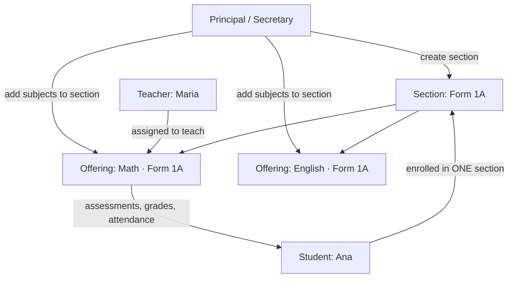

# Roles, Access & Process Flows — SIS

> **⚠️ D43 — there are now SIX roles.** HOD and Auditor were added; their rows are in §2
> below and their summaries beside the others. The rest of this document still describes
> the pre-D31 secondary-school model (sections, homerooms, "Form 1A") and was already
> flagged stale in `tertiary-refactor-plan.md` — D43 updated the ROLE content only and
> deliberately did not attempt to de-stale the vocabulary around it.
>
> **Purpose.** A plain-language reference for what each of the six roles _is_, what it can _see and do_ in every module, and how work _flows_ between roles. Use this as the map when we go section-by-section: point at a row and tell me how you want it to behave.
>
> **Sources.** Authoritative rules come from `requirements.md` §2 (the permission matrix) and §3 (functional requirements). The "As built in the demo" notes are what the current `npm run demo` build actually renders today (observed 2026-07-02) — where that differs from the intended design, it's called out as a **Gap**.
>
> Scope note: this describes behavior, not code. No code changes were made to produce this document.

---

## 0. The demo at a glance

The demo is a frontend-only build (MSW mocks, no backend/DB) seeded with **one coherent fake school**:

- **School:** Belmopan Comprehensive High School (a Belize secondary school).
- **Size:** 45 students · 12 teachers · 8 sections (homerooms) · 11 subjects · 54 (section, subject) offerings.
- **Frozen "today":** 2025-10-15, Academic Year 2025–2026, Semester 1. (All figures are anchored to this date so they never drift.)

**How to sign in (demo only):** the login screen has one‑click role buttons (Principal / Secretary / Teacher / Student). Under the hood the username _is_ the role word and any password works. The four canned users:

| Role | Demo user | Notes |
|------|-----------|-------|
| Principal | **Alicia Mendez** | School-wide admin |
| Secretary | **Sofia Castillo** | Records & enrollment admin |
| Teacher | **Maria Reyes** | Teaches Math & Physics; owns several offerings |
| Student | **Ana Lopez** | Enrolled in section **Form 1A** |

---

## 1. The core model (this is the part you flagged)

The school follows a **self-contained homeroom** model, not a "students roam between classrooms" model:

- A **Section** (a.k.a. homeroom / class, e.g. *Form 1A*) has **one fixed roster of students** for the whole year.
- **Subjects are taught _inside_ a section.** Each (section, subject) pairing is an **offering** — e.g. *"Math in Form 1A."* An offering owns its own assessments, gradebook, and teacher assignment.
- A **Student** belongs to **exactly one section** and simply receives every subject taught in it. **The student does not move.**
- A **Teacher** is attached to **offerings** — the specific (section, subject) pairs they teach. A teacher moves _across_ sections; e.g. Maria teaches Math in Form 1A **and** Physics in Form 2B.

So: **students stay in their section; teachers move between sections.** ✅ This matches how you described it, and it's what the spec intends (FR-CLS-07).



**Vocabulary we'll use section-by-section:**
- **Section / homeroom** = the class a student lives in.
- **Offering** = a (section, subject) pair = the unit a teacher owns.
- **Enrollment** = student ↔ section link for a term.

---

## 2. The permission matrix (authoritative — requirements.md §2)

Capability legend: **Full** = create/read/update/delete/configure · **Create-Edit** = add & edit, no delete/config · **View-all** = read across whole school · **View-own** = read only their own records · **None** = hidden.

| Module | Principal | Secretary | Teacher | Student | HOD | Auditor |
|--------|-----------|-----------|---------|---------|-----|---------|
| Dashboard | View-all (school) | View-all (admin) | View-own (their classes) | View-own (their data) | View-own (own teaching) | View-all (school) |
| Students | Full | Full | View-own (students in their classes) | View-own (own profile, read-only) | View-all (their programme) | View-all |
| Teachers | Full | Create-Edit | View-all (directory, read-only) | **None** | View-all (their programme) | View-all |
| Classes | Full | Create-Edit | View-own (offerings they teach) | View-own (their one section + its subjects) | View-all (their programme) | View-all |
| Assessments | View-all | View-all | **Full (own classes)** | View-own (their classes) | Full (own classes) | View-all |
| Grades | View-all | View-all | **Create-Edit (own classes)** | View-own (own grades) | Create-Edit (own) · View-all (programme) | View-all |
| Attendance | View-all | View-all | **Create-Edit (own classes)** | View-own (own attendance) | Create-Edit (own) · View-all (programme) | View-all |
| Announcements | Full (school-wide) | Full (school-wide) | Create-Edit (own classes) | View-own (targeted to them) | Create-Edit (own classes) | View-all (never authors) |
| Reports | View-all (+ any transcript) | View-all (+ any transcript) | View-own (their gradebooks; **no transcript**) | View-own (own report card; **no transcript**) | View-all (programme gradebooks; **no transcript**) | View-all (+ any transcript) |
| Settings | Full (school + academic config) | Create-Edit (limited config) | View-own (account only) | View-own (account only) | View-own (account) + catalog | View-all + **Audit log** |

**One-line role summaries**
- **Principal** — the administrator. Sees everything school-wide, owns Settings (year/term, grading scale, users). Doesn't routinely enter grades/attendance but can view all of it.
- **Secretary** — the records clerk. Creates/edits students, teachers, classes; posts school-wide announcements. **Cannot** delete teachers, change roles, edit the grading scale, or open/close a term.
- **Teacher** — the practitioner. Full control over **their own** assessments; enters grades & attendance for **their own** offerings only; posts announcements to their own classes. No access to other teachers' data or Settings.
- **HOD (Head of Department)** — a Lecturer who also runs a programme. Keeps every lecturer power on the offerings they actually teach, and additionally *reads* every student, course, offering and colleague in the programme(s) they head. Cannot edit a colleague's grades — that is stopped by ownership, per offering, not by the role. No transcripts, no admissions, no Settings beyond their own account and the read-only catalog.
- **Auditor** — sees everything, changes nothing. The only role that can open the **Audit log**. The write ban is enforced centrally rather than route-by-route, so it holds for endpoints that do not exist yet.
- **Student** — the read-only consumer. Sees only **their own** classes, assessments, grades, attendance, report card, and announcements targeted to them.

---

## 3. Role-by-role: navigation, dashboard, and flow

### 3.1 Principal — *"Run the school"*

**Sidebar:** Dashboard · Students · Teachers · Classes · Assessments · Grades · Attendance · Announcements · Reports · Settings (7 tabs).

**Dashboard should show (FR-DASH-02):** school-wide counts (students, teachers, sections), current-term attendance rate, recent school-wide announcements, charts (enrollment by grade, grade distribution).
**As built:** shows Active students (41), Active teachers (11), Sections (8), attendance rate + enrollment/grade-distribution charts + recent announcements. *(This is the richest dashboard; see Gaps for "make it more actionable".)*

**Typical flow:**
1. Sign in → school-wide dashboard.
2. Configure the year in **Settings** (academic year/term, grading scale, subjects, users).
3. Oversee via **Reports** (any student's transcript) and read-only **Grades/Attendance/Assessments**.
4. Post **school-wide announcements**.

### 3.2 Secretary — *"Manage the records"*

**Sidebar:** same as Principal **except Settings is limited** (account + limited config; no grading-scale/term controls).

**Dashboard should show (FR-DASH-03):** administrative tasks — recent enrollments, students/classes needing setup, quick links to add a student/teacher/class.
**As built:** currently renders the **same school-wide admin dashboard as the Principal** (counts + charts). **Gap:** the admin task-list / quick-add shortcuts from FR-DASH-03 aren't there yet.

**Typical flow:**
1. Sign in → admin dashboard.
2. **Students** → enroll/edit a student, assign to a section.
3. **Classes** → create a section, add subjects (offerings) to it.
4. **Teachers** → add/edit a teacher (cannot delete or change role).
5. Post **school-wide announcements**.

### 3.3 Teacher — *"Teach my classes"*

**Sidebar:** Dashboard · Students (own) · Teachers (read-only directory) · **My Teaching** (Classes/Assessments/Grades/Attendance scoped to own offerings) · Announcements · Reports (own) · Settings (account only).

**Dashboard should show (FR-DASH-04):** the teacher's classes, **today's attendance status per class (recorded / not)**, upcoming/recent assessments, quick links to record attendance or enter grades.
**As built:** shows *My classes*, *Attendance due today*, *Ungraded items*, today's classes list, recent assessments, targeted announcements. *(Closest to spec of all four.)*

**Typical flow (the daily loop):**
1. Sign in → teacher dashboard: *"which of my sections still need attendance today?"*
2. **Attendance** → open the section register (e.g. Form 1A · 6 students) → mark Present/Absent/Late/Excused.
3. **Assessments** → create a quiz/test/exam for an offering they teach.
4. **Grades** → enter scores privately → **release** them to students.
5. **Announcements** → post a notice to their own class.

> Ownership rule: a teacher can only act on **offerings they're assigned to**. They cannot enter grades/attendance for a section they don't teach (FR-GRD-10, FR-ATT-09).

> **D42 §3 — ownership now bounds what they SEE on a student, not only what they can act on.**
> A Lecturer reaches a student's profile as soon as they share one offering with them, and
> that used to open a page listing every course the student takes and every mark in all of
> them. `GET /students/{id}`, `/assessments`, `/years` and the directory's course COUNT are
> all filtered to the caller's own offerings now. The Academic history tab is gone for them
> entirely — its endpoint was already Dean/Registrar-only, so the tab had been rendering a
> 403 where content should be.

### 3.4 Student — *"See my own school life"*

**Sidebar:** Dashboard · **My School** (Classes) · My Classes/Assessments/My Grades/My Attendance · Announcements · Reports (own report card) · My Profile · Settings (account only). **No Students or Teachers modules.**

**Dashboard should show (FR-DASH-05):** the student's current classes, recent grades, attendance summary, upcoming assessments, announcements targeted to them.
**As built:** shows Term average (e.g. 69.3 / D), Attendance %, Upcoming assessments count, My classes list, recent **released** grades, upcoming assessments, announcements.

**Typical flow:**
1. Sign in → personal dashboard.
2. **My Grades** → released grades per subject + term average (never sees unreleased grades or other students).
3. **My Attendance** → own attendance record and rates.
4. **Reports** → own report card (**no transcript** — that's admin-only).
5. Read **announcements** targeted to them.

---

## 4. Module-by-module: who sees what (the fix-planning table)

For each module, "what the role experiences." Use this to tell me the target behavior per section.

| Module | Principal / Secretary | Teacher | Student |
|--------|-----------------------|---------|---------|
| **Dashboard** | School-wide KPIs + charts + announcements | Own classes, attendance-due-today, ungraded, assessments | Own term avg, attendance, upcoming, released grades |
| **Students** | Full directory; create/edit/enroll/status | Read-only, **only students in their offerings** — and on a student's profile, only **their own** courses, grades and years (D42 §3); no Academic history tab | *(no list — reaches own record via My Profile)* |
| **Teachers** | Full (P) / Create-Edit (S) directory; profile has an **academic-year switcher** (D42 §2) | Own profile only, same year switcher | **Hidden** |
| **Classes** | All sections + offerings; create sections, add subjects | **Only their offerings** | **Only their one section + its subjects** |
| **Assessments** | View-all (oversight) | **Full on own offerings** (create/edit/delete) | View-own: their section's assessments; own score once released |
| **Grades** | View-all gradebooks | **Create-Edit own** + release control | Own grades + term grade, once released |
| **Attendance** | View-all summaries | **Record for own sections** | Own attendance history + summary |
| **Announcements** | Create school-wide | Create for own classes | Read those targeted to them |
| **Reports** | Any student's report card **+ transcript** | Own offerings' gradebooks; **no transcript** | Own report card; **no transcript** |
| **Settings** | School/year/term/grading/users (P full, S limited) | Account only | Account only |

---

## 5. Cross-role process flows

**A. Setup → teaching → learning (the backbone)**
```
Principal            Secretary               Teacher                 Student
   │ set year/term       │                       │                      │
   │ set grading scale   │                       │                      │
   │────────────────────▶│ create sections       │                      │
   │                     │ add subjects→offerings │                      │
   │                     │ enroll students────────┼──────────────────────▶ lands in one section
   │ assign teachers to offerings ───────────────▶│ teaches those offerings
   │                     │                        │ create assessments    │
   │                     │                        │ enter + RELEASE grades ▶ sees released grades
   │                     │                        │ record attendance ─────▶ sees own attendance
   │ view reports/transcripts ◀────────────────── │ view own gradebooks    ▶ sees own report card
```

**B. Grade release (why a student sometimes sees nothing yet)**
1. Teacher enters scores → grade is **private**.
2. Teacher hits **Release** → grade becomes visible to that student only.
3. Student's dashboard/My Grades reflect **only released** grades; term average recomputes.

**C. Attendance daily loop**
1. Teacher dashboard flags sections with no attendance recorded for *today*.
2. Teacher opens the section register → marks each student.
3. Student's attendance summary + Principal/Secretary school-wide rate update.

---

## 6. Gaps I noticed in the current demo (candidate fix list)

Ranked roughly by how much they undercut the "role-aware" feel. None are broken pages — they're places where the demo shows a broader view than the role should get, or a dashboard that's thinner than the spec.

1. **Student "My Classes" shows the whole school.** Clicking *My Classes* renders *"Sections (homerooms) across the school"* — the admin list — instead of **the student's one section and its subjects** (FR-CLS-07). This is the single biggest mismatch with the model you described.
2. **Student "Assessments" shows school-wide.** Same pattern: the student sees *"Browse assessments across the school"* rather than **only their own section's** assessments (FR-ASMT-06).
3. **Secretary dashboard = Principal dashboard.** It repeats school-wide KPIs instead of the **admin task list + quick-add** shortcuts the spec asks for (FR-DASH-03). This is likely part of "the dashboard isn't helpful."
4. **Dashboards are informational, not actionable.** Across roles the tiles report numbers but few link anywhere. Candidate: make each tile a shortcut (e.g. teacher "Attendance due today → open register", secretary "Add student").
5. **Teachers module visible to Teacher as a full directory.** Spec allows View-all read-only, so this is compliant — but confirm you want teachers browsing the staff directory at all.

> Tell me which of these to start with and how you want each to behave, and I'll do them one section at a time.

